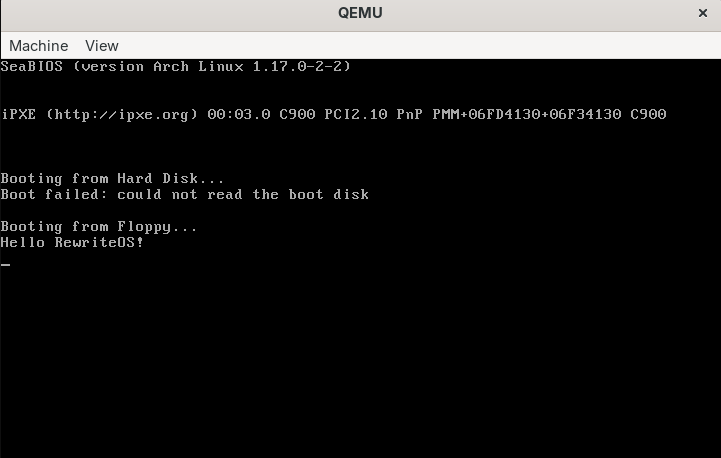
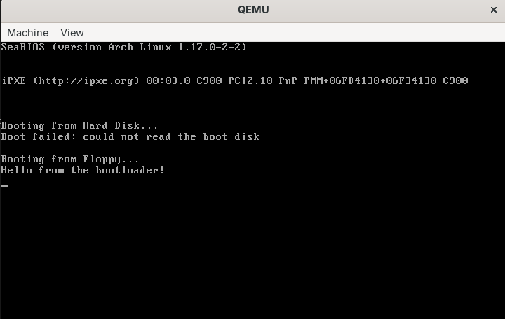
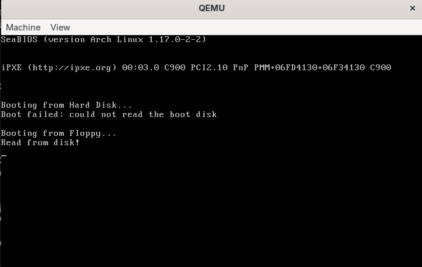
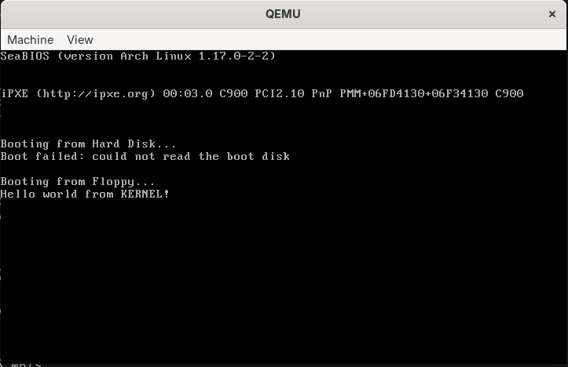
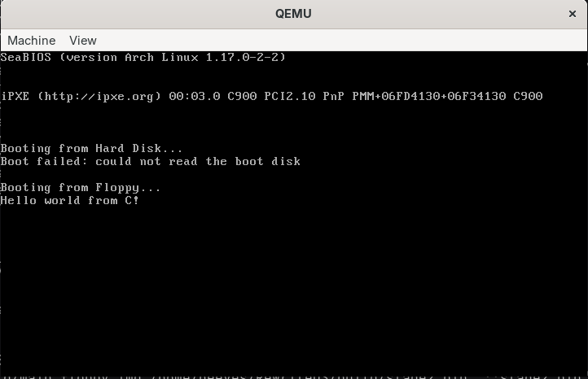
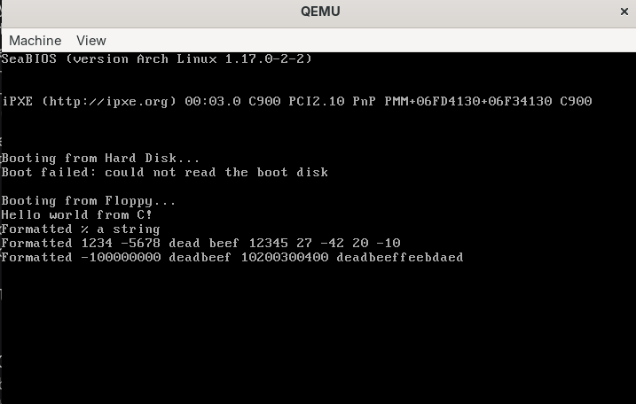

# Rewrite_OS

[English Version](#english) | [Version Française](#french)

---

## <a id="english"></a> 🇬🇧 English Version

A hobby operating system written from scratch for x86, following the *Building an OS* series by nanobyte. Goal: one small step per day, over about 3 months, with my own notes for each step.



### Tools

- `nasm`: assembler
- `make`: build system
- `qemu-system-i386`: virtual machine to test the OS
- `dosfstools` (`mkfs.fat`) and `mtools` (`mcopy`, `mdir`): build and inspect the FAT12 floppy image
- `gcc`: compiler for the small FAT12 reader tool that runs on my PC
- Open Watcom 2 (`wcc`, `wlink`), installed in `/opt/watcom`: 16-bit C compiler for stage 2 of the bootloader
- Developed on Arch Linux

### Build and run

```bash
make run     # assembles the bootloader and kernel, builds the FAT12 floppy image, starts QEMU
make clean   # removes the build/ folder
make         # also builds the FAT12 reader tool: ./build/tools/fat build/main_floppy.img test.txt
```

### Progress

| Day | Topic | Notes |
|-----|-------|-------|
| 1 | Boot sector, "Hello World" with BIOS `int 0x10` | [docs/day01-tests.md](docs/day01-tests.md) |
| 2 | Bootloader / kernel split, FAT12 floppy image | [docs/day02.md](docs/day02.md) |
| 3 | Reading the disk: LBA to CHS, `int 0x13` | [docs/day03.md](docs/day03.md) |
| 4 | The FAT12 file system, reading a file in C | [docs/day04.md](docs/day04.md) |
| 5 | The bootloader loads the kernel from FAT12 | [docs/day05.md](docs/day05.md) |
| 6 | Two-stage bootloader, stage 2 in C (Open Watcom) | [docs/day06.md](docs/day06.md) |
| 7 | `printf` from scratch: varargs, state machine, 64-bit division | [docs/day07.md](docs/day07.md) |
| 8 | Reading the disk from C: BIOS wrappers, DISK layer | [docs/day08.md](docs/day08.md) |
| 9 | The FAT driver in stage 2: open, read, paths | [docs/day09.md](docs/day09.md) |

---

### Day 1: what I learned

#### 1. What is assembly?
Assembly is machine code written in a human-readable way. An instruction is a mnemonic plus 0 to 2 operands (`mov ax, 5`). NASM turns it into bytes. Here we target x86.

#### 2. How a PC boots (legacy mode)
The BIOS reads the first sector (512 bytes) of the disk and checks that its last 2 bytes equal `0xAA55`. It then loads the sector at `0x7C00` and jumps to it. My OS starts there.

#### 3. Directives vs instructions
A directive guides NASM and is not turned into machine code:

- `org 0x7C00`: "compute addresses starting at 0x7C00". It does not force the BIOS to load there, it only informs NASM.
- `bits 16`: the CPU always starts in 16-bit mode, for backward compatibility with the 8086.
- `times 510-($-$$) db 0`: `$` is the current line, `$$` the start of the section, so `$-$$` is the code size so far. It pads with zeros up to 510 bytes.
- `dw 0AA55h`: the last 2 bytes (the boot signature).

#### 4. Registers and segments
Registers are tiny, very fast memories inside the CPU (`ax`, `si`, `sp`, `ds`, `ss`...). A real address is computed as **segment × 16 + offset**. Several pairs give the same address: `0x0000:0x7C00` and `0x07C0:0x0000` are both `0x7C00`. Another rule: a constant cannot be written directly into a segment register, so we go through `ax`:

```nasm
mov ax, 0
mov ds, ax
```

#### 5. The stack
It is last-in, first-out (`push`/`pop`) and is used by `call`/`ret`. It grows **downwards** in memory, so we set `sp = 0x7C00`: it grows away from our code and does not overwrite it.

#### 6. Printing text (`puts`)
- `lodsb`: loads the byte at `ds:si` into `al`, then `si++`.
- `or al, al`: leaves `al` unchanged but updates the zero flag. `jz .done` leaves the loop when the character is 0.
- `int 0x10` with `ah = 0x0E`: asks the BIOS to print the character in `al`. Also set `bh = 0` (page).
- A new line is `0x0D, 0x0A` (carriage return + line feed).

#### Note about the "Boot failed" message in QEMU
At startup SeaBIOS first tries the hard disk. QEMU has none, so it prints "Boot failed: could not read the boot disk", then falls back to the floppy, which is my image. This is normal and not a bug in my code.

---

### Day 2: what I learned



#### 1. Why split into bootloader and kernel?
The boot sector is only 512 bytes, too small for a real OS. The bootloader (in the boot sector) loads the kernel, a separate file, from the rest of the disk and hands over control. The code now lives in `src/bootloader/boot.asm` and `src/kernel/main.asm`.

#### 2. Why a FAT12 floppy image?
Every BIOS and virtual machine supports floppies, images are easy to create, and FAT12 is simple. The kernel becomes a real file (`kernel.bin`) instead of raw sectors.

#### 3. Building the image
`dd` creates an empty 1.44 MB file (2880 × 512 bytes), `mkfs.fat -F 12` formats it, `dd ... conv=notrunc` writes the bootloader into the first sector, and `mcopy` copies `kernel.bin` into the image without mounting it (no `sudo`).

#### 4. The FAT12 header
Writing the bootloader over the first sector erases the headers that describe the disk, so `mcopy` fails with `non DOS media`. The bootloader must therefore start with `jmp short start`, a `nop`, then the BPB and the EBR fields:

| Field | Value |
|-------|-------|
| Bytes per sector | 512 |
| Sectors per cluster | 1 |
| Reserved sectors | 1 |
| Number of FATs | 2 |
| Root directory entries | `0E0h` (224) |
| Total sectors | 2880 |
| Media descriptor | `0F0h` (3.5" floppy) |
| Sectors per FAT | 9 |
| Sectors per track | 18 |
| Heads | 2 |

#### 5. Little-endian
Multi-byte numbers are stored low byte first: 512 = `0x0200` is stored as `00 02`, and the serial number bytes `12 34 56 78` form the value `0x78563412`, which `mdir` shows as `7856-3412`.

---

### Day 3: what I learned



#### 1. CHS and LBA
A disk is divided into cylinders, heads and sectors (**CHS**). The BIOS wants CHS, but it is simpler for me to number sectors with one value (**LBA**), so the bootloader converts: `sector = (LBA % 18) + 1`, `head = (LBA / 18) % 2`, `cylinder = (LBA / 18) / 2` (for 18 sectors per track and 2 heads).

#### 2. Reading with the BIOS
`int 0x13` with `ah = 02h` reads sectors. `al` = number of sectors, `ch`/`cl` = cylinder and sector, `dh` = head, `dl` = drive, `es:bx` = destination in memory. On failure the carry flag (CF) is set.

#### 3. Reliability
Floppy disks are unreliable, so the bootloader tries up to 3 times, resetting the disk controller between attempts. If all fail, it prints an error, waits for a key (`int 0x16`) and reboots with `jmp 0FFFFh:0`.

#### 4. Checking the result
`make run-monitor` opens QEMU with its monitor in the terminal. The command `xp /16xb 0x7e00` shows the loaded sector: the start of the FAT table (`f0 ff ff ff 0f ...`), where the entry for `kernel.bin` (cluster 2) marks the end of its chain.

#### 5. `cli` before `hlt`
`cli` disables interrupts so that `hlt` really stops the CPU.

---

### Day 4: what I learned


#### 1. What is a file system?
It is the way data is organized on a storage device, like the filing system of a library. FAT12 is very simple, which is why it is used for floppy disks and for getting started.

#### 2. The 4 regions of a FAT12 disk
Reserved sectors (boot sector and header), the FAT table (two copies), the root directory (the list of files) and the data region (the contents of the files).

#### 3. Finding a file
Compute where the root directory starts, read it, find the entry whose 11-character name matches, take its first cluster, convert the cluster to a sector (`start of data region + (cluster - 2) * sectors per cluster`), read it, then follow the FAT table to the next cluster until `0xFF8` or more.

#### 4. FAT12 entries are 12 bits
For cluster `n`, the entry starts at byte `n * 3 / 2`. If `n` is even I keep the low 12 bits, otherwise I shift right by 4.

#### 5. A C tool to test the logic
`tools/fat/fat.c` reads a file from the image on my PC: `./build/tools/fat build/main_floppy.img test.txt`. On day 5, I will translate the same logic into assembly so the bootloader can load `kernel.bin` by itself.

#### 6. Layout of my floppy (LBA)

| Area | Start (LBA) | Size (sectors) |
|------|-------------|----------------|
| Boot sector (reserved) | 0 | 1 |
| FAT 1 | 1 | 9 |
| FAT 2 | 10 | 9 |
| Root directory | 19 | 14 |
| Data region (cluster 2) | 33 | 2847 |

`kernel.bin` is cluster 2 (sector 33), `test.txt` is cluster 3 (sector 34).

---

### Day 5: what I learned



#### 1. The bootloader loads the kernel by itself
It now does in assembly what my C program did on day 4: compute where the root directory is and read it, look for the 11-character name `KERNEL  BIN` (`repe cmpsb`), take its first cluster, read the FAT table, then load the file cluster by cluster, following the 12-bit FAT chain until `0xFF8`.

#### 2. Handing over control
The kernel is loaded at `0x2000:0000` (physical `0x20000`), in the large free area of real-mode memory. The bootloader sets `ds` and `es` to `0x2000`, keeps the boot drive in `dl` and does a far jump. That is why the kernel is assembled with `org 0`.

#### 3. Limits I know about
`add ax, 31` only works on a 1.44 MB floppy, and `add bx, 512` overflows past 64 KB. Only 46 bytes are left in the boot sector, which is why the next step is a second stage.

---

### Day 6: what I learned



#### 1. Two stages
The boot sector is too small (only 46 free bytes left), so it now does one job: find `stage2.bin` in the FAT12 root directory and load it. **Stage 2** is written in C and is no longer limited to 512 bytes. The code is split into `src/bootloader/stage1`, `src/bootloader/stage2` and `src/kernel`, each with its own `Makefile`.

#### 2. C in real mode needs Open Watcom
We are still in 16-bit real mode, and GCC cannot produce that code, but Open Watcom can. Important options: `-ms` (small memory model), `-zl` (no standard library), `-s` (no stack checks).

#### 3. A raw binary with the entry point first
The linker script (`FORMAT RAW BIN`, `OFFSET=0`, `START=entry`) makes the first byte of `stage2.bin` the entry point, so stage 1 can jump straight into it. In the `.map` file, the entry address must be `0`.

#### 4. The cdecl calling convention
Arguments are pushed right to left, the result comes back in `ax`, and the caller cleans the stack. Inside a function: `[bp+2]` is the return address and `[bp+4]` the first argument. Reading `[bp+2]` by mistake prints the same letter `T` over and over (the low byte of the return address).

#### 5. C and assembly together
C cannot call a BIOS interrupt, so `x86_Video_WriteCharTeletype` is in assembly and `putc` / `puts` in C call it.

---

### Day 7: what I learned



#### 1. Variable arguments on the stack
With cdecl, arguments are pushed right to left, so the first one (`fmt`) is always at the same place. I take its address (`argp = (int*) &fmt`) and move forward one word per argument: a `char` or `short` takes 1 word (2 bytes in 16-bit mode), a `long` takes 2, a `long long` takes 4.

#### 2. A state machine to read the format
`NORMAL` prints characters until a `%`, then `LENGTH` (`h`, `hh`, `l`, `ll`), then `SPEC` (`c`, `s`, `d`, `i`, `u`, `x`, `p`, `o`, `%`). An unknown specifier is ignored.

#### 3. Printing a number in any base
Divide by the base repeatedly: each remainder is a digit (looked up in `"0123456789abcdef"`), and the digits come out in reverse order.

#### 4. The 64-bit division problem
In 16-bit real mode the CPU can divide at most 64 bits by 32 bits, with a 32-bit quotient. The compiler asked for a library function I do not have, so I wrote `x86_div64_32` in assembly: two 32-bit divisions in a row (long division in base 2³²).

#### 5. Same bits, different meaning
`printf("%d %u", -1, -1)` prints `-1 65535`: in 16 bits, `-1` is `0xFFFF`, read as signed or unsigned.

---

### Day 8: what I learned


#### 1. A `DISK` structure instead of globals
Everything about a disk (drive number, cylinders, heads, sectors) lives in a `DISK` structure passed to each function, so the code does not depend on global state.

#### 2. BIOS calls through assembly wrappers
C cannot call `int 13h`, so `x86_Disk_Reset`, `x86_Disk_Read` and `x86_Disk_GetDriveParams` are written in assembly. They return a C boolean using `mov ax, 1` then `sbb ax, 0` (1 if the carry flag is clear).

#### 3. The geometry trap
`int 13h` with `ah = 08h` gives the **highest** cylinder and head numbers, so I add 1 (79 becomes 80 cylinders, 1 becomes 2 heads). Without that, LBA 19 is read from sector 37 and the root directory is garbage.

#### 4. Compiler helpers
Dividing or multiplying 32-bit numbers in 16-bit mode makes the compiler call `__U4D` and `__U4M`. With the library disabled (`-zl`), I write them in assembly.

#### 5. A build lesson
After replacing files with a zip, `make clean` first: old object files can look up to date and get linked with new ones.

---

### Day 9: what I learned


#### 1. A `stdio.h`-like interface
`FAT_Open` returns a handle (the index of a slot in a table of 10 open files), then `FAT_Read`, `FAT_ReadEntry` and `FAT_Close`. The disk is passed to each function.

#### 2. No `malloc`: I choose where the memory goes
The big buffers live in a `FAT_Data` structure at a fixed address (segment `0x0050`, physical `0x00500`, up to 64 KB), followed by the FAT table. It is outside stage 2's segment, hence **far** pointers.

#### 3. One 512-byte buffer per file
The disk reads whole sectors, but `FAT_Read` can return any number of bytes. The next sector is loaded when the buffer is used up, following the 12-bit FAT chain until `0xFF8`.

#### 4. Paths and 8.3 names
`FAT_Open("mydir/test.txt")` splits the path at each `/`, finds each element in the current directory (`test.txt` becomes `TEST    TXT`), and opens it. The root directory is a special case: it is not in the FAT.

#### 5. A bug I found
With more than 16 files in the root directory, a search that reads a later sector leaves the buffer on that sector, and the next open fails. `FAT_Open` therefore reloads the root directory's first sector on each call.

---

### Credits and license

- This project follows the **"Building an OS"** video series by [nanobyte](https://www.youtube.com/playlist?list=PLFjM7v6KGMpiH2G-kT781ByCNC_0pKpPN). The explanations, journal and tests are my own notes.
- Reference documentation: the OSDev wiki (FAT file system) and Ralf Brown's Interrupt List.
- Released under the **MIT license**, see [LICENSE](LICENSE). If you reuse code that comes from the original tutorial, check the license of the original repository too.

---

## <a id="french"></a> 🇫🇷 Version Française

Un système d'exploitation de loisir (hobby OS) écrit à partir de zéro pour l'architecture x86, en suivant la série *Building an OS* de nanobyte. Objectif : faire un petit pas par jour sur environ 3 mois, avec mes propres notes pour chaque étape.


### Outils

- `nasm` : l'assembleur
- `make` : le système de build
- `qemu-system-i386` : la machine virtuelle pour tester l'OS
- `dosfstools` (`mkfs.fat`) et `mtools` (`mcopy`, `mdir`) : pour créer et inspecter l'image disquette FAT12
- `gcc` : compilateur du petit outil de lecture FAT12 qui tourne sur mon PC
- Open Watcom 2 (`wcc`, `wlink`), installé dans `/opt/watcom` : compilateur C 16 bits pour la stage 2 du bootloader
- Développé sous Arch Linux

### Compilation et exécution

```bash
make run     # assemble le bootloader et le kernel, génère l'image disquette FAT12 et lance QEMU
make clean   # supprime le dossier de build (build/)
make         # compile aussi l'outil de lecture FAT12 : ./build/tools/fat build/main_floppy.img test.txt
```

### Progression

| Jour | Sujet | Notes |
|------|-------|-------|
| 1 | Secteur d'amorçage, "Hello World" avec l'interruption BIOS `int 0x10` | [docs/day01-tests.md](docs/day01-tests.md) |
| 2 | Séparation bootloader / kernel, image disquette FAT12 | [docs/day02.md](docs/day02.md) |
| 3 | Lecture du disque : LBA vers CHS, `int 0x13` | [docs/day03.md](docs/day03.md) |
| 4 | Le système de fichiers FAT12, lecture d'un fichier en C | [docs/day04.md](docs/day04.md) |
| 5 | Le bootloader charge le kernel depuis FAT12 | [docs/day05.md](docs/day05.md) |
| 6 | Bootloader en deux étapes, stage 2 en C (Open Watcom) | [docs/day06.md](docs/day06.md) |
| 7 | `printf` à partir de zéro : arguments variables, machine à états, division 64 bits | [docs/day07.md](docs/day07.md) |
| 8 | Lire le disque depuis le C : enveloppes BIOS, couche DISK | [docs/day08.md](docs/day08.md) |
| 9 | Le pilote FAT dans la stage 2 : ouvrir, lire, chemins | [docs/day09.md](docs/day09.md) |

---

### Jour 1 : ce que j'ai appris

#### 1. Qu'est-ce que l'assembleur ?
L'assembleur est du code machine écrit d'une manière lisible par l'humain. Une instruction est composée d'un mnémonique et de 0 à 2 opérandes (`mov ax, 5`). NASM transforme cela en octets. Ici, nous ciblons l'architecture x86.

#### 2. Comment un PC démarre (mode legacy)
Le BIOS lit le premier secteur (512 octets) du disque et vérifie que ses 2 derniers octets sont égaux à `0xAA55`. Il charge ensuite ce secteur à l'adresse mémoire `0x7C00` et saute (jump) dessus. C'est là que mon OS commence.

#### 3. Directives vs instructions
Une directive guide NASM et n'est pas transformée en code machine :

- `org 0x7C00` : "calcule les adresses en commençant à 0x7C00". Cela ne force pas le BIOS à charger le code à cet endroit, cela informe simplement NASM.
- `bits 16` : le processeur démarre toujours en mode 16 bits, pour des raisons de rétrocompatibilité avec le 8086.
- `times 510-($-$$) db 0` : `$` représente la ligne actuelle, `$$` le début de la section, donc `$-$$` donne la taille du code écrit jusqu'ici. Cette commande remplit le reste avec des zéros jusqu'à atteindre 510 octets.
- `dw 0AA55h` : les 2 derniers octets (la signature d'amorçage ou *boot signature*).

#### 4. Registres et segments
Les registres sont de toutes petites mémoires très rapides situées directement dans le processeur (`ax`, `si`, `sp`, `ds`, `ss`...). Une adresse réelle se calcule ainsi : **segment × 16 + offset**. Plusieurs paires de valeurs peuvent donner la même adresse physique : `0x0000:0x7C00` et `0x07C0:0x0000` pointent toutes les deux vers `0x7C00`. Autre règle : on ne peut pas écrire une constante directement dans un registre de segment, il faut obligatoirement passer par `ax` :

```nasm
mov ax, 0
mov ds, ax
```

#### 5. La pile (The stack)
Elle fonctionne selon le principe du "dernier entré, premier sorti" (`push`/`pop`) et est utilisée par `call`/`ret`. Elle grandit **vers le bas** de la mémoire, c'est pourquoi nous définissons `sp = 0x7C00` : elle s'éloigne ainsi de notre code et ne risque pas de l'écraser.

#### 6. Afficher du texte (`puts`)
- `lodsb` : charge l'octet situé à l'adresse `ds:si` dans `al`, puis incrémente `si` (`si++`).
- `or al, al` : laisse `al` inchangé mais met à jour le drapeau zéro (*zero flag*). `jz .done` permet de quitter la boucle lorsque le caractère lu est égal à 0.
- `int 0x10` avec `ah = 0x0E` : demande au BIOS d'afficher le caractère contenu dans `al`. On définit également `bh = 0` (la page d'affichage).
- Un saut de ligne est représenté par `0x0D, 0x0A` (retour chariot + saut de ligne).

#### Note concernant le message "Boot failed" dans QEMU
Au démarrage, SeaBIOS cherche d'abord à démarrer sur le disque dur. QEMU n'en ayant pas, il affiche "Boot failed: could not read the boot disk", puis bascule sur la disquette, qui contient mon image. C'est un comportement tout à fait normal et ce n'est pas un bug dans mon code.

---

### Jour 2 : ce que j'ai appris


#### 1. Pourquoi séparer bootloader et kernel ?
Le boot sector ne fait que 512 octets, trop peu pour un vrai OS. Le bootloader (dans le boot sector) charge le kernel, un fichier à part, depuis le reste du disque, puis lui laisse la main. Le code est maintenant dans `src/bootloader/boot.asm` et `src/kernel/main.asm`.

#### 2. Pourquoi une image disquette FAT12 ?
Tous les BIOS et toutes les machines virtuelles gèrent les disquettes, les images se créent facilement, et FAT12 est simple. Le kernel devient un vrai fichier (`kernel.bin`) au lieu de secteurs bruts.

#### 3. Construire l'image
`dd` crée un fichier vide de 1,44 Mo (2880 × 512 octets), `mkfs.fat -F 12` le formate, `dd ... conv=notrunc` écrit le bootloader dans le premier secteur, et `mcopy` copie `kernel.bin` dans l'image sans la monter (pas de `sudo`).

#### 4. L'en-tête FAT12
Écrire le bootloader sur le premier secteur efface les en-têtes qui décrivent le disque, donc `mcopy` échoue avec `non DOS media`. Le bootloader doit donc commencer par `jmp short start`, un `nop`, puis les champs du BPB et de l'EBR :

| Champ | Valeur |
|-------|--------|
| Octets par secteur | 512 |
| Secteurs par cluster | 1 |
| Secteurs réservés | 1 |
| Nombre de FAT | 2 |
| Entrées du répertoire racine | `0E0h` (224) |
| Nombre total de secteurs | 2880 |
| Type de média | `0F0h` (disquette 3,5") |
| Secteurs par FAT | 9 |
| Secteurs par piste | 18 |
| Têtes | 2 |

#### 5. Little-endian
Les nombres sur plusieurs octets sont stockés en commençant par l'octet de poids faible : 512 = `0x0200` s'écrit `00 02`, et les octets `12 34 56 78` du numéro de série forment la valeur `0x78563412`, que `mdir` affiche `7856-3412`.

---

### Jour 3 : ce que j'ai appris


#### 1. CHS et LBA
Un disque est divisé en cylindres, têtes et secteurs (**CHS**). Le BIOS veut du CHS, mais il est plus simple pour moi de numéroter les secteurs avec un seul nombre (**LBA**). Le bootloader convertit donc : `secteur = (LBA % 18) + 1`, `tête = (LBA / 18) % 2`, `cylindre = (LBA / 18) / 2` (pour 18 secteurs par piste et 2 têtes).

#### 2. Lire avec le BIOS
`int 0x13` avec `ah = 02h` lit des secteurs. `al` = nombre de secteurs, `ch`/`cl` = cylindre et secteur, `dh` = tête, `dl` = lecteur, `es:bx` = destination en mémoire. En cas d'échec, le flag carry (CF) est à 1.

#### 3. Fiabilité
Les disquettes sont peu fiables, donc le bootloader réessaie jusqu'à 3 fois en réinitialisant le contrôleur entre deux essais. Si tout échoue, il affiche une erreur, attend une touche (`int 0x16`) et redémarre avec `jmp 0FFFFh:0`.

#### 4. Vérifier le résultat
`make run-monitor` ouvre QEMU avec son moniteur dans le terminal. La commande `xp /16xb 0x7e00` montre le secteur chargé : le début de la table FAT (`f0 ff ff ff 0f ...`), où l'entrée de `kernel.bin` (cluster 2) marque la fin de sa chaîne.

#### 5. `cli` avant `hlt`
`cli` désactive les interruptions pour que `hlt` arrête vraiment le processeur.

---

### Jour 4 : ce que j'ai appris


#### 1. Un système de fichiers, c'est quoi ?
C'est la manière d'organiser les données sur un support, comme le classement d'une bibliothèque. FAT12 est très simple, c'est pourquoi on l'utilise pour les disquettes et pour commencer.

#### 2. Les 4 régions d'un disque FAT12
Les secteurs réservés (boot sector et en-tête), la table FAT (deux copies), le répertoire racine (la liste des fichiers) et la zone de données (le contenu des fichiers).

#### 3. Retrouver un fichier
Calculer où commence le répertoire racine, le lire, trouver l'entrée dont le nom de 11 caractères correspond, prendre son premier cluster, le convertir en secteur (`début de la zone de données + (cluster - 2) * secteurs par cluster`), le lire, puis suivre la table FAT vers le cluster suivant jusqu'à `0xFF8` ou plus.

#### 4. Les entrées FAT12 font 12 bits
Pour le cluster `n`, l'entrée commence à l'octet `n * 3 / 2`. Si `n` est pair je garde les 12 bits de poids faible, sinon je décale de 4 vers la droite.

#### 5. Un outil en C pour tester la logique
`tools/fat/fat.c` lit un fichier dans l'image sur mon PC : `./build/tools/fat build/main_floppy.img test.txt`. Au jour 5, je traduirai la même logique en assembleur pour que le bootloader charge `kernel.bin` tout seul.

#### 6. Plan de ma disquette (LBA)

| Zone | Début (LBA) | Taille (secteurs) |
|------|-------------|-------------------|
| Secteur de boot (réservé) | 0 | 1 |
| FAT 1 | 1 | 9 |
| FAT 2 | 10 | 9 |
| Répertoire racine | 19 | 14 |
| Zone de données (cluster 2) | 33 | 2847 |

`kernel.bin` est le cluster 2 (secteur 33), `test.txt` est le cluster 3 (secteur 34).

---

### Jour 5 : ce que j'ai appris


#### 1. Le bootloader charge le kernel tout seul
Il fait maintenant en assembleur ce que mon programme en C faisait au jour 4 : calculer où est le répertoire racine et le lire, chercher le nom de 11 caractères `KERNEL  BIN` (`repe cmpsb`), prendre son premier cluster, lire la table FAT, puis charger le fichier cluster par cluster en suivant la chaîne FAT de 12 bits jusqu'à `0xFF8`.

#### 2. Passer la main
Le kernel est chargé à `0x2000:0000` (adresse physique `0x20000`), dans la grande zone libre du mode réel. Le bootloader met `ds` et `es` à `0x2000`, garde le lecteur de démarrage dans `dl` et fait un saut lointain. C'est pourquoi le kernel est assemblé avec `org 0`.

#### 3. Les limites que je connais
`add ax, 31` ne marche que sur une disquette de 1,44 Mo, et `add bx, 512` déborde au-delà de 64 Ko. Il ne reste que 46 octets dans le boot sector, c'est pourquoi la suite est une seconde étape (stage 2).

---

### Jour 6 : ce que j'ai appris


#### 1. Deux étapes
Le boot sector est trop petit (il ne reste que 46 octets libres), donc il n'a plus qu'un rôle : trouver `stage2.bin` dans le répertoire racine FAT12 et le charger. La **stage 2** est écrite en C et n'a plus la limite des 512 octets. Le code est séparé en `src/bootloader/stage1`, `src/bootloader/stage2` et `src/kernel`, chacun avec son propre `Makefile`.

#### 2. Du C en mode réel demande Open Watcom
On est toujours en mode réel 16 bits, et GCC ne sait pas produire ce code, alors qu'Open Watcom le sait. Options importantes : `-ms` (modèle mémoire small), `-zl` (pas de bibliothèque standard), `-s` (pas de vérification de pile).

#### 3. Un binaire brut avec le point d'entrée en premier
Le script d'édition de liens (`FORMAT RAW BIN`, `OFFSET=0`, `START=entry`) fait du premier octet de `stage2.bin` le point d'entrée, donc la stage 1 peut sauter directement dessus. Dans le fichier `.map`, l'adresse d'entrée doit être `0`.

#### 4. La convention d'appel cdecl
Les arguments sont empilés de droite à gauche, le résultat revient dans `ax`, et l'appelant nettoie la pile. Dans une fonction : `[bp+2]` est l'adresse de retour et `[bp+4]` le premier argument. Lire `[bp+2]` par erreur affiche toujours la même lettre `T` (l'octet de poids faible de l'adresse de retour).

#### 5. C et assembleur ensemble
Le C ne peut pas appeler une interruption BIOS : `x86_Video_WriteCharTeletype` est en assembleur, et `putc` / `puts` en C l'appellent.

---

### Jour 7 : ce que j'ai appris


#### 1. Les arguments variables sur la pile
Avec cdecl, les arguments sont empilés de droite à gauche, donc le premier (`fmt`) est toujours au même endroit. Je prends son adresse (`argp = (int*) &fmt`) et j'avance d'un mot par argument : un `char` ou un `short` occupe 1 mot (2 octets en mode 16 bits), un `long` 2, un `long long` 4.

#### 2. Une machine à états pour lire le format
`NORMAL` affiche les caractères jusqu'à un `%`, puis `LENGTH` (`h`, `hh`, `l`, `ll`), puis `SPEC` (`c`, `s`, `d`, `i`, `u`, `x`, `p`, `o`, `%`). Un spécificateur inconnu est ignoré.

#### 3. Afficher un nombre dans n'importe quelle base
On divise par la base à répétition : chaque reste est un chiffre (cherché dans `"0123456789abcdef"`), et les chiffres sortent à l'envers.

#### 4. Le problème de la division 64 bits
En mode réel 16 bits, le processeur divise au maximum 64 bits par 32 bits, avec un quotient de 32 bits. Le compilateur demandait une fonction de bibliothèque que je n'ai pas, j'ai donc écrit `x86_div64_32` en assembleur : deux divisions de 32 bits à la suite (la division posée, en base 2³²).

#### 5. Les mêmes bits, un sens différent
`printf("%d %u", -1, -1)` affiche `-1 65535` : sur 16 bits, `-1` vaut `0xFFFF`, lu en signé ou en non signé.

---

### Jour 8 : ce que j'ai appris


#### 1. Une structure `DISK` plutôt que des variables globales
Tout ce qui concerne un disque (numéro du lecteur, cylindres, têtes, secteurs) est dans une structure `DISK` passée à chaque fonction, donc le code ne dépend d'aucun état global.

#### 2. Les appels BIOS passent par des enveloppes en assembleur
Le C ne sait pas appeler `int 13h` : `x86_Disk_Reset`, `x86_Disk_Read` et `x86_Disk_GetDriveParams` sont écrites en assembleur. Elles retournent un booléen C avec `mov ax, 1` puis `sbb ax, 0` (1 si le flag de retenue est à 0).

#### 3. Le piège de la géométrie
`int 13h` avec `ah = 08h` donne les **plus grands** numéros de cylindre et de tête, donc j'ajoute 1 (79 devient 80 cylindres, 1 devient 2 têtes). Sans cela, le LBA 19 est lu au secteur 37 et le répertoire racine est illisible.

#### 4. Les aides du compilateur
Diviser ou multiplier des nombres de 32 bits en mode 16 bits fait appeler `__U4D` et `__U4M` par le compilateur. Avec la bibliothèque désactivée (`-zl`), je les écris en assembleur.

#### 5. Une leçon sur la compilation
Après avoir remplacé des fichiers avec un zip, faire `make clean` d'abord : d'anciens fichiers objets peuvent sembler à jour et être liés avec des nouveaux.

---

### Jour 9 : ce que j'ai appris


#### 1. Une interface proche de `stdio.h`
`FAT_Open` rend une poignée (l'indice d'un emplacement dans un tableau de 10 fichiers ouverts), puis `FAT_Read`, `FAT_ReadEntry` et `FAT_Close`. Le disque est passé à chaque fonction.

#### 2. Pas de `malloc` : je choisis où va la mémoire
Les gros tampons sont dans une structure `FAT_Data` à une adresse fixe (segment `0x0050`, physique `0x00500`, 64 Ko au maximum), suivie de la table FAT. C'est en dehors du segment de la stage 2, d'où les pointeurs **far**.

#### 3. Un tampon de 512 octets par fichier
Le disque lit des secteurs entiers, mais `FAT_Read` peut rendre n'importe quel nombre d'octets. Le secteur suivant est chargé quand le tampon est épuisé, en suivant la chaîne FAT de 12 bits jusqu'à `0xFF8`.

#### 4. Chemins et noms 8.3
`FAT_Open("mydir/test.txt")` découpe le chemin à chaque `/`, retrouve chaque élément dans le dossier courant (`test.txt` devient `TEST    TXT`) et l'ouvre. La racine est un cas particulier : elle n'est pas dans la FAT.

#### 5. Un bug que j'ai trouvé
Avec plus de 16 fichiers à la racine, une recherche qui lit un secteur plus loin laisse le tampon sur ce secteur, et l'ouverture suivante échoue. `FAT_Open` recharge donc le premier secteur de la racine à chaque appel.

---

### Crédits et licence

- Ce projet suit la série de vidéos **« Building an OS »** de [nanobyte](https://www.youtube.com/playlist?list=PLFjM7v6KGMpiH2G-kT781ByCNC_0pKpPN). Les explications, le journal et les tests sont mes propres notes.
- Documentation de référence : le wiki OSDev (système de fichiers FAT) et la liste d'interruptions de Ralf Brown.
- Publié sous **licence MIT**, voir [LICENSE](LICENSE). Si tu réutilises du code issu du tutoriel d'origine, vérifie aussi la licence du dépôt d'origine.
