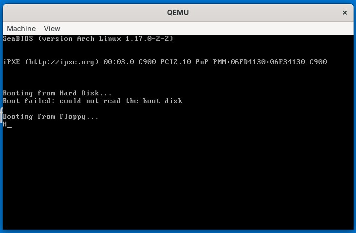
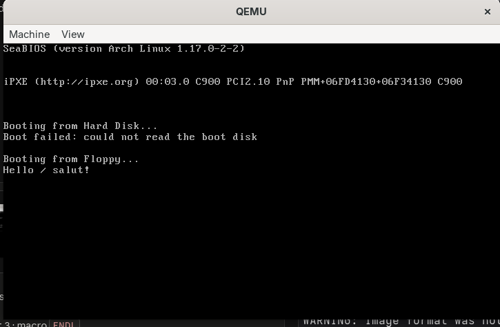
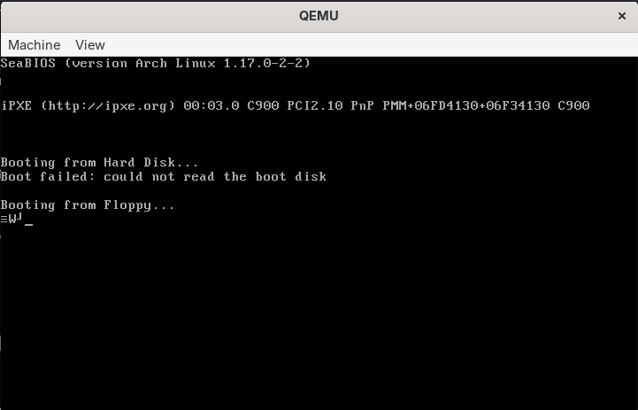
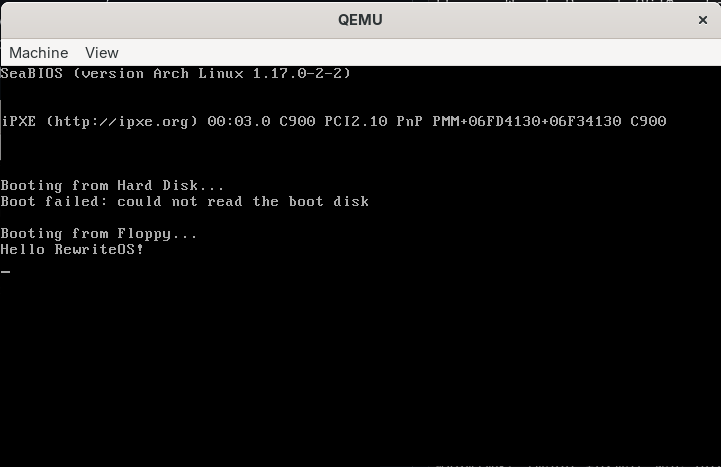

# Jour 1 : tests et erreurs / Day 1: Tests and Errors

[Version Française](#french) | [English Version](#english)

---

##  🇫🇷 Version Française

Journal des expériences faites sur `main.asm`. Pour chaque test : ce que je prévois, ce que j'observe, et pourquoi.

### Résultat de référence

Le message `Hello RewriteOS!` s'affiche : le boot sector fonctionne.

### Message « Boot failed: could not read the boot disk »

* **Observé :** juste avant mon message, QEMU affiche `Booting from Hard Disk... Boot failed: could not read the boot disk`, puis `Booting from Floppy...`.
* **Explication :** le BIOS (SeaBIOS) essaie d'abord le disque dur, qui n'existe pas dans QEMU, puis passe à la disquette. Ce n'est pas une erreur de mon code.
* **Option :** ajouter `-boot a` dans la règle `run` du Makefile pour démarrer directement sur la disquette.

### Test 1 : calcul d'adresse (papier)

* **Question :** quelle adresse réelle donne `0x1234:0x0010` ?
* **Mon calcul :** _à compléter_
* **Vérification :** segment × 16 + offset

### Test 2 : enlever le `jmp .loop` dans `puts`

* **Prévu :** le programme n'affiche que le premier caractère.
* **Observé :** seul `H` s'affiche, pas le message entier.

* **Pourquoi :** `lodsb` lit `H`, `int 0x10` l'affiche, puis sans `jmp .loop` le code ne revient pas au début de la boucle : il tombe dans `.done`, restaure les registres (`pop`) et fait `ret`. `main` continue ensuite jusqu'au `hlt`.
* **Détail :** `.loop` et `.done` sont des labels locaux (ils commencent par un point), rattachés au dernier label normal au-dessus d'eux, ici `puts`. Ils s'appellent en réalité `puts.loop` et `puts.done`.

### Test 3 : macro `ENDL`

* **Modification :** `%define ENDL 0x0D, 0x0A` puis `msg: db 'Salut', ENDL, 0`
* **Observé :** aucun grand changement visible.

* **Pourquoi :** `ENDL` est placé à la fin du message. Il envoie un retour chariot (`0x0D`) puis un saut de ligne (`0x0A`), donc il déplace seulement le curseur au début de la ligne suivante. Le texte affiché ne change pas.
* **À essayer pour voir la différence :** mettre `ENDL` au milieu, par exemple `msg: db 'Hello', ENDL, 'salut!', 0`.

### Test 4 : `sp = 0x7E00` au lieu de `0x7C00`

* **Prévu :** ça devrait encore fonctionner. La pile descend depuis `0x7E00`, donc ses premières écritures se font à `0x7DFE` et en dessous, c'est-à-dire à la fin du secteur de 512 octets déjà chargé en mémoire. Mon code et mon message sont au début du secteur (à partir de `0x7C00`), loin de cette zone.
* **Observé :** des caractères illisibles s'affichent à la place du message.

* **Pourquoi :** en remplaçant `0x7C00` par `0x7E00`, j'ai aussi modifié la ligne `org` : j'avais `org sp = 0x7E00` (au lieu de `org 0x7C00`) et `mov sp, sp = 0x7E00` (au lieu de `mov sp, 0x7E00`). NASM n'a signalé aucune erreur : il lit `sp = 0x7E00` comme une comparaison dont le résultat vaut 0. Avec `org 0`, il calcule l'adresse de `msg_hello` à `0x002B` au lieu de `0x7C2B`. Le code lisait donc la mémoire à l'adresse `0x002B` (la table des interruptions du BIOS) et affichait n'importe quoi.
* **Correction :** garder `org 0x7C00` et écrire `mov sp, 0x7E00`.

* **À retenir :** `org` indique à NASM où le BIOS charge le code, alors que `sp` est l'adresse du haut de la pile : deux valeurs indépendantes.

### Erreurs rencontrées

| Erreur / symptôme | Cause | Solution |
|-------------------|-------|----------|
| `fatal: not a git repository` | `git init` pas encore fait | `git init` à la racine du projet |
| `make: *** No rule to make target 'run'` | `make` lancé depuis `src/`, le `Makefile` est dans le dossier parent | `cd ..` puis `make run` |
| `GraphQL: Name already exists on this account` | le dépôt GitHub existe déjà | `git remote add origin <url>` puis `git push -u origin main` |
| `cannot pull with rebase: You have unstaged changes` | des modifications non commitées | `git add .` puis `git commit`, ensuite `git pull --rebase origin main` |
| `rejected ... (fetch first)` au `git push` | le dépôt distant contient un commit absent en local | `git pull --rebase origin main` puis `git push` |
| `404 - page not found` sur `docs/images/...png` | le dossier `docs/images/` était vide, Git ne suit pas les dossiers vides | copier l'image dans `docs/images/`, puis `git add .`, `git commit`, `git push` |
| `This repository moved` | le dépôt s'appelle `Rewrite_Os` (casse différente) | `git remote set-url origin https://github.com/Rabb-hemery/Rewrite_Os.git` |
| Caractères illisibles au lieu du message | `org` modifié par erreur en même temps que `sp` (`org sp = 0x7E00`), NASM le lit comme une comparaison = 0 | remettre `org 0x7C00` et écrire `mov sp, 0x7E00` |

---

##  🇬🇧 English Version

Log of experiments performed on `main.asm`. For each test: what I expect, what I observe, and why.

### Reference result

The message `Hello RewriteOS!` is displayed: the boot sector works.

### "Boot failed: could not read the boot disk" message

* **Observed:** just before my message, QEMU prints `Booting from Hard Disk... Boot failed: could not read the boot disk`, then `Booting from Floppy...`.
* **Explanation:** the BIOS (SeaBIOS) tries the hard disk first, which does not exist in QEMU, then falls back to the floppy. This is not a bug in my code.
* **Option:** add `-boot a` to the `run` rule in the Makefile to boot directly from the floppy.

### Test 1: address calculation (paper)

* **Question:** what real address does `0x1234:0x0010` yield?
* **My calculation:** _to be completed_
* **Verification:** segment × 16 + offset

### Test 2: removing `jmp .loop` in `puts`

* **Expected:** only the first character gets printed.
* **Observed:** only `H` is displayed, not the whole message.

* **Why:** `lodsb` reads `H`, `int 0x10` prints it, then without `jmp .loop` the code does not go back to the start of the loop: it falls into `.done`, restores the registers (`pop`) and executes `ret`. `main` then continues to the `hlt`.
* **Detail:** `.loop` and `.done` are local labels (they start with a dot), attached to the last regular label above them, here `puts`. Their real names are `puts.loop` and `puts.done`.

### Test 3: `ENDL` macro

* **Modification:** `%define ENDL 0x0D, 0x0A` then `msg: db 'Hi', ENDL, 0`
* **Observed:** no major visible change.

* **Why:** `ENDL` is at the end of the message. It sends a carriage return (`0x0D`) then a line feed (`0x0A`), so it only moves the cursor to the start of the next line. The displayed text does not change.
* **To see the difference:** put `ENDL` in the middle, for example `msg: db 'Hello', ENDL, 'hi!', 0`.

### Test 4: `sp = 0x7E00` instead of `0x7C00`

* **Expected:** it should still work. The stack grows down from `0x7E00`, so its first writes land at `0x7DFE` and below, i.e. at the end of the 512-byte sector already loaded in memory. My code and message are at the start of the sector (from `0x7C00`), far from that area.
* **Observed:** unreadable characters are displayed instead of the message.

* **Why:** when replacing `0x7C00` with `0x7E00`, I also changed the `org` line: I had `org sp = 0x7E00` (instead of `org 0x7C00`) and `mov sp, sp = 0x7E00` (instead of `mov sp, 0x7E00`). NASM reported no error: it reads `sp = 0x7E00` as a comparison whose result is 0. With `org 0`, it computes the address of `msg_hello` as `0x002B` instead of `0x7C2B`. The code was therefore reading memory at `0x002B` (the BIOS interrupt vector table) and printing garbage.
* **Fix:** keep `org 0x7C00` and write `mov sp, 0x7E00`.

  
* **Takeaway:** `org` tells NASM where the BIOS loads the code, while `sp` is the top of the stack: two independent values.

### Errors encountered

| Error / symptom | Cause | Solution |
|-----------------|-------|----------|
| `fatal: not a git repository` | `git init` not done yet | `git init` at the project root |
| `make: *** No rule to make target 'run'` | `make` run from `src/`, the `Makefile` is in the parent folder | `cd ..` then `make run` |
| `GraphQL: Name already exists on this account` | the GitHub repository already exists | `git remote add origin <url>` then `git push -u origin main` |
| `cannot pull with rebase: You have unstaged changes` | uncommitted changes | `git add .` then `git commit`, then `git pull --rebase origin main` |
| `rejected ... (fetch first)` on `git push` | the remote has a commit missing locally | `git pull --rebase origin main` then `git push` |
| `404 - page not found` on `docs/images/...png` | `docs/images/` was empty, Git does not track empty folders | copy the image into `docs/images/`, then `git add .`, `git commit`, `git push` |
| `This repository moved` | the repository is named `Rewrite_Os` (different case) | `git remote set-url origin https://github.com/Rabb-hemery/Rewrite_Os.git` |
| Garbage characters instead of the message | `org` changed by mistake along with `sp` (`org sp = 0x7E00`), NASM reads it as a comparison = 0 | restore `org 0x7C00` and write `mov sp, 0x7E00` |
