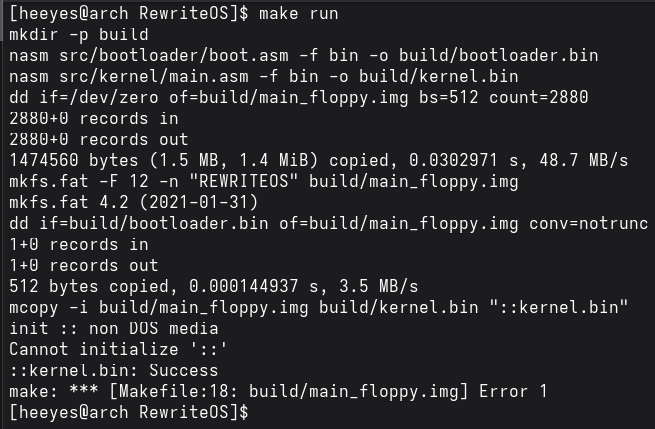
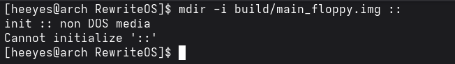
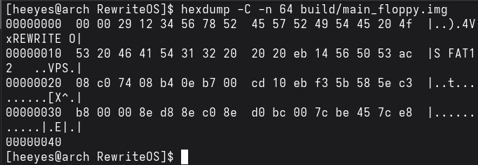

# Jour 2 : bootloader, kernel et disquette FAT12 / Day 2: Bootloader, Kernel and FAT12 Floppy

[Version Française](#french) | [English Version](#english)

---

## <a id="french"></a> 🇫🇷 Version Française

### Objectif

Séparer le projet en deux modules (`bootloader` et `kernel`), créer une vraie image disquette FAT12 qui contient `kernel.bin` comme fichier, et ajouter l'en-tête FAT12 au boot sector pour que l'image reste valide.

### Résultat


`mdir -i build/main_floppy.img ::` liste bien `kernel.bin` (512 octets) dans l'image, dont le volume s'appelle `REWRITEOS` :

```
 Volume in drive : is REWRITEOS
 Volume Serial Number is 7856-3412
Directory for ::/

kernel   bin       512 2026-10-02  21:20
        1 file                  512 bytes
                          1 457 152 bytes free
```

Le kernel n'est pas encore exécuté : il est seulement copié sur le disque. Le jour 3 apprendra au bootloader à le lire.

### Ce que j'ai compris

#### Pourquoi séparer bootloader et kernel ?
Le boot sector ne fait que 512 octets, c'est trop peu pour un vrai OS. Le bootloader, placé dans ce secteur, charge donc le reste du système (le kernel) depuis le disque, puis lui laisse la main. Tous les OS font ainsi.

#### Pourquoi une disquette FAT12 ?
C'est le support le plus simple : tous les BIOS et toutes les machines virtuelles le gèrent, les images se créent facilement, et FAT12 est un système de fichiers très simple. Le kernel devient un vrai fichier (`kernel.bin`) au lieu de secteurs bruts, et on peut échanger des fichiers avec Windows ou Linux.

#### Comment est construite l'image (Makefile)
1. `dd` crée un fichier vide de 1,44 Mo (2880 secteurs × 512 octets).
2. `mkfs.fat -F 12` y crée le système de fichiers FAT12.
3. `dd ... conv=notrunc` écrit le bootloader dans le premier secteur (sans tronquer le reste de l'image).
4. `mcopy` copie `kernel.bin` dans l'image, sans la monter et donc sans `sudo`.

#### Pourquoi l'en-tête FAT12 (BPB et EBR) ?
Le premier secteur contient les informations qui décrivent le disque : octets par secteur, secteurs par piste, nombre de FAT, etc. Mon `dd` écrase ce secteur avec le bootloader, donc l'image devient invalide et `mcopy` refuse de travailler (`non DOS media`). La solution est de recopier ces champs au début de `boot.asm`, juste après `jmp short start` et `nop`, dans l'ordre exact attendu : le BPB, puis l'EBR.

### Mini-exos

#### Exo 1 : reproduire l'erreur `mcopy`

* **Ce que j'ai fait :** retiré de `boot.asm` le `jmp short start`, le `nop` et tout le BPB, puis lancé `make`.
* **Message d'erreur :** `init :: non DOS media`, puis `Cannot initialize '::'` et `make: *** Error 1`.





* **Explication :** sans l'en-tête, le premier secteur commence directement par la fin de l'EBR (`00 00 29 12 34 56 78 ...`). `mcopy` lit le champ « octets par secteur » à l'offset 11, où il trouve maintenant les octets `49 54` (les lettres `IT` du label). Ça fait `0x5449 = 21577` octets par secteur, une valeur impossible, donc il refuse l'image.



#### Exo 2 : le fichier est sur la disquette

* **Commande :** `mdir -i build/main_floppy.img ::`
* **Observé :** le fichier `kernel.bin` de 512 octets apparaît (voir plus haut).

#### Exo 3 : repérer l'en-tête dans les octets

* **Commande :** `hexdump -C -n 64 build/main_floppy.img`
* **Résultat sur l'image valide :**

```
00000000  eb 3c 90 4d 53 57 49 4e  34 2e 31 00 02 01 01 00  |.<.MSWIN4.1.....|
00000010  02 e0 00 40 0b f0 09 00  12 00 02 00 00 00 00 00  |...@............|
00000020  00 00 00 00 00 00 29 12  34 56 78 52 45 57 52 49  |......).4VxREWRI|
00000030  54 45 20 4f 53 20 46 41  54 31 32 20 20 20 eb 14  |TE OS FAT12   ..|
00000040
```

* **`MSWIN4.1` à l'offset 3** (`4d 53 57 49 4e 34 2e 31`), juste après `eb 3c 90` (le `jmp short start` suivi du `nop`).
* **`00 02` à l'offset 11** : le nombre d'octets par secteur. 512 s'écrit `0x0200` en hexadécimal, et en *little-endian* on stocke l'octet de poids faible d'abord, donc `00 02`.

#### Exo 4 : calculs sur papier

* `0E0h` = 14 × 16 = **224** : c'est le nombre d'entrées du répertoire racine.
* `2880 × 512` = **1 474 560 octets** : c'est la taille d'une disquette 1,44 Mo.

#### Exo 5 : le numéro de série

* J'ai écrit `12h, 34h, 56h, 78h` dans l'en-tête, mais `mdir` affiche `7856-3412`.
* **Pourquoi :** le numéro de série est un nombre de 4 octets stocké en *little-endian* : le premier octet (`12`) est celui de poids faible. La valeur réelle est donc `0x78563412`, que `mdir` affiche sous la forme `7856-3412`. Pour voir `1234-5678`, il aurait fallu écrire `78h, 56h, 34h, 12h`.

### Erreurs rencontrées

| Erreur / symptôme | Cause | Solution |
|-------------------|-------|----------|
| `error: the following file has local modifications: src/main.asm` (avec `git rm`) | le fichier avait des modifications non commitées | `git rm -f src/main.asm` |
| `init :: non DOS media` / `Cannot initialize '::'` | l'en-tête FAT12 manque dans le boot sector (exo 1) | remettre le `jmp short start`, le `nop`, le BPB et l'EBR dans `boot.asm` |
| `WARNING: Image format was not specified ... guessed raw` (QEMU) | QEMU devine le format de l'image | inoffensif ; pour le retirer : `-drive format=raw,file=...,if=floppy` dans la règle `run` |

---

## <a id="english"></a> 🇬🇧 English Version

### Goal

Split the project into two modules (`bootloader` and `kernel`), build a real FAT12 floppy image that contains `kernel.bin` as a file, and add the FAT12 header to the boot sector so the image stays valid.

### Result


`mdir -i build/main_floppy.img ::` lists `kernel.bin` (512 bytes) in the image, whose volume is named `REWRITEOS`:

```
 Volume in drive : is REWRITEOS
 Volume Serial Number is 7856-3412
Directory for ::/

kernel   bin       512 2026-10-02  21:20
        1 file                  512 bytes
                          1 457 152 bytes free
```

The kernel is not executed yet: it is only copied onto the disk. Day 3 will teach the bootloader to read it.

### What I understood

#### Why split into bootloader and kernel?
The boot sector is only 512 bytes, far too small for a real OS. The bootloader, placed in that sector, loads the rest of the system (the kernel) from the disk and then hands over control. All operating systems work this way.

#### Why a FAT12 floppy?
It is the simplest storage: every BIOS and virtual machine supports it, images are easy to create, and FAT12 is a very simple file system. The kernel becomes a real file (`kernel.bin`) instead of raw sectors, and files can be exchanged with Windows or Linux.

#### How the image is built (Makefile)
1. `dd` creates an empty 1.44 MB file (2880 sectors × 512 bytes).
2. `mkfs.fat -F 12` creates the FAT12 file system in it.
3. `dd ... conv=notrunc` writes the bootloader into the first sector (without truncating the rest of the image).
4. `mcopy` copies `kernel.bin` into the image, without mounting it and therefore without `sudo`.

#### Why the FAT12 header (BPB and EBR)?
The first sector holds the information that describes the disk: bytes per sector, sectors per track, number of FATs, and so on. My `dd` overwrites that sector with the bootloader, so the image becomes invalid and `mcopy` refuses to work (`non DOS media`). The fix is to copy those fields to the start of `boot.asm`, right after `jmp short start` and `nop`, in the exact order expected: the BPB, then the EBR.

### Mini-exercises

#### Exercise 1: reproducing the `mcopy` error

* **What I did:** removed the `jmp short start`, the `nop` and the whole BPB from `boot.asm`, then ran `make`.
* **Error message:** `init :: non DOS media`, then `Cannot initialize '::'` and `make: *** Error 1`.


* **Explanation:** without the header, the first sector starts directly with the end of the EBR (`00 00 29 12 34 56 78 ...`). `mcopy` reads the "bytes per sector" field at offset 11, where it now finds the bytes `49 54` (the letters `IT` of the label). That gives `0x5449 = 21577` bytes per sector, an impossible value, so it rejects the image.


#### Exercise 2: the file is on the floppy

* **Command:** `mdir -i build/main_floppy.img ::`
* **Observed:** the 512-byte `kernel.bin` file shows up (see above).

#### Exercise 3: finding the header in the bytes

* **Command:** `hexdump -C -n 64 build/main_floppy.img`
* **Result on the valid image:**

```
00000000  eb 3c 90 4d 53 57 49 4e  34 2e 31 00 02 01 01 00  |.<.MSWIN4.1.....|
00000010  02 e0 00 40 0b f0 09 00  12 00 02 00 00 00 00 00  |...@............|
00000020  00 00 00 00 00 00 29 12  34 56 78 52 45 57 52 49  |......).4VxREWRI|
00000030  54 45 20 4f 53 20 46 41  54 31 32 20 20 20 eb 14  |TE OS FAT12   ..|
00000040
```

* **`MSWIN4.1` at offset 3** (`4d 53 57 49 4e 34 2e 31`), right after `eb 3c 90` (the `jmp short start` followed by the `nop`).
* **`00 02` at offset 11**: the number of bytes per sector. 512 is `0x0200` in hexadecimal, and in *little-endian* the low byte is stored first, hence `00 02`.

#### Exercise 4: paper calculations

* `0E0h` = 14 × 16 = **224**: the number of root directory entries.
* `2880 × 512` = **1,474,560 bytes**: the size of a 1.44 MB floppy.

#### Exercise 5: the serial number

* I wrote `12h, 34h, 56h, 78h` in the header, but `mdir` shows `7856-3412`.
* **Why:** the serial number is a 4-byte value stored in *little-endian*: the first byte (`12`) is the least significant one. The real value is therefore `0x78563412`, which `mdir` prints as `7856-3412`. To see `1234-5678`, I would have to write `78h, 56h, 34h, 12h`.

### Errors encountered

| Error / symptom | Cause | Solution |
|-----------------|-------|----------|
| `error: the following file has local modifications: src/main.asm` (with `git rm`) | the file had uncommitted changes | `git rm -f src/main.asm` |
| `init :: non DOS media` / `Cannot initialize '::'` | the FAT12 header is missing from the boot sector (exercise 1) | put the `jmp short start`, the `nop`, the BPB and the EBR back into `boot.asm` |
| `WARNING: Image format was not specified ... guessed raw` (QEMU) | QEMU guesses the image format | harmless; to remove it: `-drive format=raw,file=...,if=floppy` in the `run` rule |
