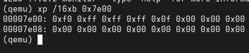
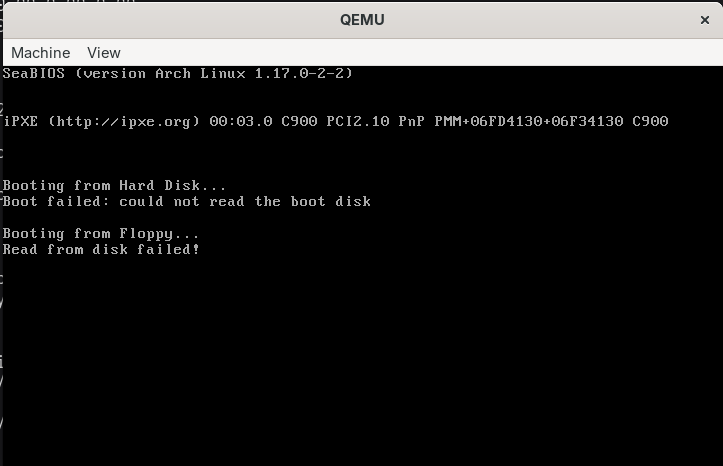

# Jour 3 : lire le disque (LBA, CHS et `int 0x13`) / Day 3: Reading the Disk (LBA, CHS and `int 0x13`)

[Version Française](#french) | [English Version](#english)

---

##  🇫🇷 Version Française

### Objectif

Apprendre au bootloader à lire un secteur du disque avec le BIOS : convertir une adresse LBA en CHS, lire avec `int 0x13`, réessayer 3 fois en cas d'échec et afficher une erreur.

### Résultat

Le bootloader lit le secteur LBA 1 vers la mémoire à l'adresse `0x7E00`, puis affiche `Read from disk!`.

### Ce que j'ai compris

#### CHS et LBA
Un disque est divisé en cylindres (pistes), en têtes (faces) et en secteurs. Le BIOS demande une adresse **CHS** (cylindre, tête, secteur). Pour mon code, il est plus simple de numéroter les secteurs avec un seul nombre, le **LBA**. Il faut donc convertir. Le cylindre et la tête commencent à 0, mais le secteur commence à **1**.

#### Les formules (18 secteurs par piste, 2 têtes)
* `secteur = (LBA % 18) + 1`
* `tête = (LBA / 18) % 2`
* `cylindre = (LBA / 18) / 2`

#### Lire avec `int 0x13`, `ah = 02h`
Il faut remplir les registres avant l'appel :
* `al` : nombre de secteurs à lire
* `ch` : 8 bits de poids faible du cylindre
* `cl` : le secteur (bits 0 à 5) et les 2 bits de poids fort du cylindre (bits 6 et 7)
* `dh` : la tête
* `dl` : le numéro du lecteur (le BIOS le donne dans `dl` au démarrage)
* `es:bx` : l'adresse mémoire où mettre les données

Si la lecture échoue, le flag **CF** (carry) vaut 1.

#### 3 tentatives et réinitialisation
Les disquettes sont peu fiables. Après un échec, je réinitialise le contrôleur (`ah = 0`, `int 0x13`) puis je réessaie, jusqu'à 3 fois. Si tout échoue, j'affiche un message d'erreur, j'attends une touche (`int 0x16`) puis je redémarre.

#### `cli` avant `hlt`
`hlt` arrête le processeur jusqu'à la prochaine interruption. Sans `cli`, une interruption (horloge, clavier) peut le réveiller et il continuerait à exécuter du code. `cli` désactive les interruptions pour qu'il reste arrêté.

### Mini-exos

#### Exo 1 : conversions LBA → CHS sur papier

| LBA | Secteur | Tête | Cylindre | CHS |
|-----|---------|------|----------|-----|
| 1 | (1 % 18) + 1 = 2 | (1 / 18) % 2 = 0 | (1 / 18) / 2 = 0 | (0, 0, 2) |
| 19 | (19 % 18) + 1 = 2 | (19 / 18) % 2 = 1 | (19 / 18) / 2 = 0 | (0, 1, 2) |
| 36 | (36 % 18) + 1 = 1 | (36 / 18) % 2 = 0 | (36 / 18) / 2 = 1 | (1, 0, 1) |

Le LBA 1 est le secteur juste après le boot sector. Au LBA 19, on change de face de la disquette. Au LBA 36, on passe au cylindre suivant.

#### Exo 2 : voir les données lues en mémoire

* **Commande :** `make run-monitor`, puis dans le terminal : `xp /16xb 0x7e00`
* **Observé :** `f0 ff ff ff 0f 00 00 00 ...`

* **Pourquoi ces octets :** à `0x7E00` se trouve le secteur LBA 1 que mon code vient de charger, c'est-à-dire le début de la **table FAT**. En FAT12, chaque entrée fait 12 bits :
  * `f0 ff ff` contient les 2 premières entrées, réservées : le type de média (`F0`) et une marque de fin.
  * `ff 0f` contient la 3e entrée, celle du **cluster 2**, où se trouve `kernel.bin`. Sa valeur est `0xFFF` (« fin de chaîne »), donc le kernel tient dans un seul cluster de 512 octets.

#### Exo 3 : faire échouer la lecture

* **Modification :** `mov ax, 5000` au lieu de `mov ax, 1`
* **Observé :** le message `Read from disk failed!` s'affiche après un petit délai.

* **Pourquoi :** une disquette de 1,44 Mo n'a que 2880 secteurs, donc le secteur 5000 n'existe pas. Le BIOS signale l'erreur (CF = 1) à chaque tentative. Après les 3 essais, le code affiche l'erreur.

#### Exo 4 : appuyer sur une touche après l'erreur

* **Observé :** _à compléter par toi après le test_ (la machine redémarre : l'écran est effacé et on revoit le démarrage du BIOS)
* **Pourquoi :** `int 0x16` attend l'appui sur une touche, puis `jmp 0FFFFh:0` saute à l'adresse physique `0xFFFF0`. Le BIOS y a une instruction qui le renvoie vers son code de démarrage, donc le BIOS recommence depuis le début. Ce n'est pas un vrai démarrage à froid du matériel, mais la machine redémarre bien.

### Pièges rencontrés

| Piège | Solution |
|-------|----------|
| Oublier de remettre `mov ax, 1` après l'exo 3 | remettre la bonne valeur avant de commiter |

---

##  🇬🇧 English Version

### Goal

Teach the bootloader to read a disk sector through the BIOS: convert an LBA address to CHS, read with `int 0x13`, retry 3 times on failure and print an error.

### Result

The bootloader reads LBA sector 1 into memory at address `0x7E00`, then prints `Read from disk!`.

### What I understood

#### CHS and LBA
A disk is divided into cylinders (tracks), heads (sides) and sectors. The BIOS wants a **CHS** address (cylinder, head, sector). In my code it is simpler to number sectors with a single value, the **LBA**, so a conversion is needed. Cylinder and head start at 0, but the sector starts at **1**.

#### The formulas (18 sectors per track, 2 heads)
* `sector = (LBA % 18) + 1`
* `head = (LBA / 18) % 2`
* `cylinder = (LBA / 18) / 2`

#### Reading with `int 0x13`, `ah = 02h`
The registers must be filled before the call:
* `al`: number of sectors to read
* `ch`: low 8 bits of the cylinder
* `cl`: the sector (bits 0 to 5) and the 2 high bits of the cylinder (bits 6 and 7)
* `dh`: the head
* `dl`: the drive number (the BIOS provides it in `dl` at boot)
* `es:bx`: the memory address where the data goes

If the read fails, the **CF** (carry) flag is 1.

#### 3 attempts and reset
Floppy disks are unreliable. After a failure, I reset the controller (`ah = 0`, `int 0x13`) and try again, up to 3 times. If everything fails, I print an error message, wait for a key (`int 0x16`) and reboot.

#### `cli` before `hlt`
`hlt` stops the processor until the next interrupt. Without `cli`, an interrupt (timer, keyboard) can wake it up and it would keep executing code. `cli` disables interrupts so it stays halted.

### Mini-exercises

#### Exercise 1: LBA → CHS conversions on paper

| LBA | Sector | Head | Cylinder | CHS |
|-----|--------|------|----------|-----|
| 1 | (1 % 18) + 1 = 2 | (1 / 18) % 2 = 0 | (1 / 18) / 2 = 0 | (0, 0, 2) |
| 19 | (19 % 18) + 1 = 2 | (19 / 18) % 2 = 1 | (19 / 18) / 2 = 0 | (0, 1, 2) |
| 36 | (36 % 18) + 1 = 1 | (36 / 18) % 2 = 0 | (36 / 18) / 2 = 1 | (1, 0, 1) |

LBA 1 is the sector right after the boot sector. At LBA 19 we switch to the other side of the floppy. At LBA 36 we move to the next cylinder.

#### Exercise 2: seeing the data read into memory

* **Command:** `make run-monitor`, then in the terminal: `xp /16xb 0x7e00`
* **Observed:** `f0 ff ff ff 0f 00 00 00 ...`

* **Why these bytes:** at `0x7E00` sits LBA sector 1, which my code has just loaded, i.e. the start of the **FAT table**. In FAT12 each entry is 12 bits:
  * `f0 ff ff` holds the first 2 entries, which are reserved: the media type (`F0`) and an end marker.
  * `ff 0f` holds the 3rd entry, the one for **cluster 2**, where `kernel.bin` lives. Its value is `0xFFF` ("end of chain"), so the kernel fits in a single 512-byte cluster.

#### Exercise 3: making the read fail

* **Change:** `mov ax, 5000` instead of `mov ax, 1`
* **Observed:** the message `Read from disk failed!` appears after a short delay.

* **Why:** a 1.44 MB floppy has only 2880 sectors, so sector 5000 does not exist. The BIOS reports the error (CF = 1) on every attempt. After the 3 tries, the code prints the error.

#### Exercise 4: pressing a key after the error

* **Observed:** _to be completed by me after the test_ (the machine reboots: the screen is cleared and the BIOS startup shows again)
* **Why:** `int 0x16` waits for a key press, then `jmp 0FFFFh:0` jumps to physical address `0xFFFF0`. The BIOS has an instruction there that sends it back to its startup code, so the BIOS starts again from the beginning. It is not a true cold start of the hardware, but the machine does restart.

### Pitfalls encountered

| Pitfall | Solution |
|---------|----------|
| Forgetting to put `mov ax, 1` back after exercise 3 | restore the right value before committing |
