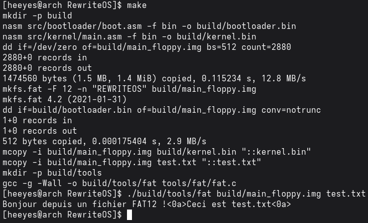
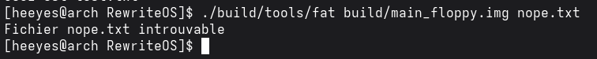
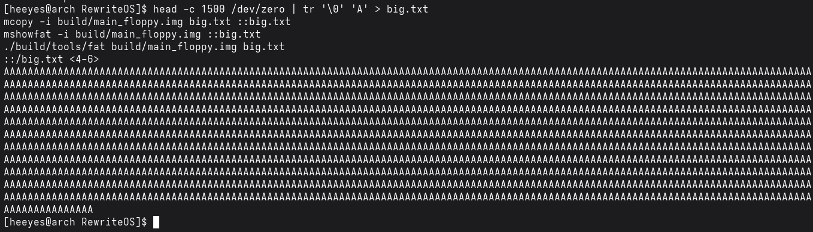
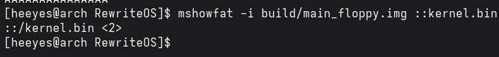

# Jour 4 : le système de fichiers FAT12 / Day 4: The FAT12 File System

[Version Française](#french) | [English Version](#english)

---

##  🇫🇷 Version Française

### Objectif

Comprendre comment FAT12 organise un disque et comment on retrouve un fichier, en écrivant un petit programme en C qui lit `test.txt` dans mon image disquette. Ce programme tourne sur mon PC, pas dans l'OS : le jour 5, je traduirai la même logique en assembleur dans le bootloader.

### Résultat

Mon programme `tools/fat/fat.c` ouvre l'image, lit le boot sector, la table FAT et le répertoire racine, retrouve `test.txt`, puis affiche son contenu (`<0a>` représente un retour à la ligne).

### Ce que j'ai compris

#### Un système de fichiers, c'est quoi ?
C'est la manière d'organiser les données sur un support, comme le classement d'une bibliothèque : sans lui, on ne retrouve rien. FAT12 est très simple, c'est pourquoi on l'utilise pour les disquettes et pour commencer.

#### Les 4 régions d'un disque FAT12
1. **Secteurs réservés :** le boot sector et son en-tête (BPB et EBR), avec la taille d'un secteur, les tailles et positions des autres régions, etc.
2. **Table FAT :** deux copies. Un tableau qui indique, pour chaque cluster, quel est le cluster suivant du fichier.
3. **Répertoire racine :** la liste des fichiers à la racine, avec pour chacun son nom, son premier cluster et sa taille.
4. **Zone de données :** le contenu des fichiers.

#### Comment retrouver un fichier, étape par étape
1. Calculer où commence le répertoire racine : secteurs réservés + (nombre de FAT × secteurs par FAT).
2. Calculer sa taille : (entrées × 32 octets) ÷ octets par secteur, arrondi au supérieur.
3. Lire le répertoire racine et chercher l'entrée dont le nom (11 caractères, par exemple `TEST    TXT`) correspond. On y récupère le **premier cluster**.
4. Convertir ce cluster en secteur : début de la zone de données + (cluster − 2) × secteurs par cluster. On soustrait 2 car les clusters 0 et 1 sont réservés.
5. Lire le cluster, puis demander à la table FAT quel est le suivant, et recommencer jusqu'à une valeur supérieure ou égale à `0xFF8` (fin de chaîne).

#### Pourquoi `cluster * 3 / 2` dans la table FAT ?
En FAT12, chaque entrée fait 12 bits, soit 1,5 octet. Pour trouver l'entrée du cluster `n`, on calcule l'octet de départ `n * 3 / 2`. On lit alors 16 bits : si `n` est pair, l'entrée est dans les 12 bits de poids faible (`& 0x0FFF`), sinon dans les 12 bits de poids fort (`>> 4`).

### Mini-exos

#### Exo 1 : calculs sur papier
Avec mon en-tête : 1 secteur réservé, 2 FAT de 9 secteurs, 224 entrées de répertoire de 32 octets, 1 secteur par cluster, 512 octets par secteur.

* **Début du répertoire racine :** secteurs réservés + (nombre de FAT × secteurs par FAT) = 1 + (2 × 9) = **secteur 19** (`0x13`).
* **Taille du répertoire racine :** (224 × 32) ÷ 512 = 7168 ÷ 512 = **14 secteurs** (`0x0E`).
* **Début de la zone de données (cluster 2) :** 19 + 14 = **secteur 33** (`0x21`).
* **LBA du cluster 5 :** 33 + (5 − 2) × 1 = **secteur 36** (`0x24`).

Plan de ma disquette (en secteurs, adresses LBA) :

| Zone | Début (LBA) | Taille (secteurs) |
|------|-------------|-------------------|
| Secteur de boot (réservé) | 0 | 1 |
| FAT 1 | 1 | 9 |
| FAT 2 | 10 | 9 |
| Répertoire racine | 19 | 14 |
| Zone de données (cluster 2) | 33 | 2880 − 33 = 2847 |
| Cluster 3 | 34 | 1 |
| Cluster 4 | 35 | 1 |
| Cluster 5 | 36 | 1 |

* **Vérification :** `dd if=build/main_floppy.img bs=512 skip=34 count=1 2>/dev/null | head -c 40` lit le secteur 34, qui correspond au cluster 3. On doit y retrouver le texte de `test.txt`. Avec `skip=33` on tombe sur le début de `kernel.bin` (cluster 2).

#### Exo 2 : lire un fichier avec mon programme

* **Commandes :** `make`, puis `./build/tools/fat build/main_floppy.img test.txt`
* **Observé :** `Bonjour depuis un fichier FAT12 !<0a>Ceci est test.txt<0a>`, c'est-à-dire le contenu du fichier avec ses retours à la ligne (voir la capture plus haut).

#### Exo 3 : un fichier qui n'existe pas

* **Commande :** `./build/tools/fat build/main_floppy.img nope.txt`
* **Observé :** `Fichier nope.txt introuvable`

* **Pourquoi :** le programme parcourt toutes les entrées du répertoire racine et compare chaque nom (11 caractères) à celui demandé. Aucune ne correspond, donc il affiche l'erreur et s'arrête.

#### Exo 4 : un fichier de plusieurs clusters

* **Commandes :** `head -c 1500 /dev/zero | tr '\0' 'A' > big.txt`, puis `mcopy -i build/main_floppy.img big.txt ::big.txt` et `mshowfat -i build/main_floppy.img ::big.txt`
* **Clusters observés :** `<4-6>`, donc les clusters 4, 5 et 6. Mon programme lit bien le fichier en entier (1500 lettres `A`).

* **Pourquoi plusieurs clusters :** un cluster fait 512 octets chez moi (1 secteur par cluster), et 1500 ÷ 512 donne un peu moins de 3, donc il en faut 3. Les clusters 2 et 3 sont déjà pris par `kernel.bin` et `test.txt`, donc `big.txt` commence au cluster 4. La table FAT relie 4 → 5 → 6 → fin de chaîne.

#### Exo 5 : où est `kernel.bin` ?

* **Commande :** `mshowfat -i build/main_floppy.img ::kernel.bin`
* **Observé :** `<2>` : `kernel.bin` occupe uniquement le cluster 2.

* **Lien avec `ff 0f` (jour 3) :** l'entrée du cluster 2 est à l'octet `2 * 3 / 2 = 3` de la table FAT, et les octets 3 et 4 valent `ff 0f`. Le cluster 2 est pair, donc on garde les 12 bits de poids faible : `0xFFF`. Cette valeur est supérieure ou égale à `0xFF8`, donc c'est la fin de chaîne : `kernel.bin` tient dans ce seul cluster.

### Erreurs rencontrées

| Erreur / symptôme | Cause | Solution |
|-------------------|-------|----------|
| `error: two or more data types in declaration specifiers` sur `typedef uint8_t bool;` | dans la norme C récente (gcc récent), `bool` est un mot réservé du langage et ne peut plus être redéfini | supprimer le `typedef` et ajouter `#include <stdbool.h>` |
| `big.txt` disparaît de l'image après un `make` | `make` recrée l'image disquette à zéro | refaire le `mcopy` après le `make` |

---

##  🇬🇧 English Version

### Goal

Understand how FAT12 lays out a disk and how a file is found, by writing a small C program that reads `test.txt` from my floppy image. The program runs on my PC, not inside the OS: on day 5 I will translate the same logic into assembly inside the bootloader.

### Result

My program `tools/fat/fat.c` opens the image, reads the boot sector, the FAT table and the root directory, finds `test.txt`, then prints its contents (`<0a>` stands for a newline).

### What I understood

#### What is a file system?
It is the way data is organized on a storage device, like the filing system of a library: without it, nothing can be found. FAT12 is very simple, which is why it is used for floppy disks and for getting started.

#### The 4 regions of a FAT12 disk
1. **Reserved sectors:** the boot sector and its header (BPB and EBR), with the sector size, the sizes and positions of the other regions, and so on.
2. **FAT table:** two copies. An array telling, for each cluster, which cluster comes next in the file.
3. **Root directory:** the list of files at the root, each with its name, first cluster and size.
4. **Data region:** the contents of the files.

#### How to find a file, step by step
1. Compute where the root directory starts: reserved sectors + (number of FATs × sectors per FAT).
2. Compute its size: (entries × 32 bytes) ÷ bytes per sector, rounded up.
3. Read the root directory and look for the entry whose name (11 characters, e.g. `TEST    TXT`) matches. From it, get the **first cluster**.
4. Convert that cluster to a sector: start of the data region + (cluster − 2) × sectors per cluster. We subtract 2 because clusters 0 and 1 are reserved.
5. Read the cluster, then ask the FAT table for the next one, and repeat until a value greater than or equal to `0xFF8` (end of chain).

#### Why `cluster * 3 / 2` in the FAT table?
In FAT12 each entry is 12 bits, i.e. 1.5 bytes. To find the entry for cluster `n`, I compute the starting byte `n * 3 / 2`. I then read 16 bits: if `n` is even, the entry is in the low 12 bits (`& 0x0FFF`), otherwise in the high 12 bits (`>> 4`).

### Mini-exercises

#### Exercise 1: paper calculations
With my header: 1 reserved sector, 2 FATs of 9 sectors each, 224 directory entries of 32 bytes, 1 sector per cluster, 512 bytes per sector.

* **Start of the root directory:** reserved sectors + (number of FATs × sectors per FAT) = 1 + (2 × 9) = **sector 19** (`0x13`).
* **Size of the root directory:** (224 × 32) ÷ 512 = 7168 ÷ 512 = **14 sectors** (`0x0E`).
* **Start of the data region (cluster 2):** 19 + 14 = **sector 33** (`0x21`).
* **LBA of cluster 5:** 33 + (5 − 2) × 1 = **sector 36** (`0x24`).

Layout of my floppy (in sectors, LBA addresses):

| Area | Start (LBA) | Size (sectors) |
|------|-------------|----------------|
| Boot sector (reserved) | 0 | 1 |
| FAT 1 | 1 | 9 |
| FAT 2 | 10 | 9 |
| Root directory | 19 | 14 |
| Data region (cluster 2) | 33 | 2880 − 33 = 2847 |
| Cluster 3 | 34 | 1 |
| Cluster 4 | 35 | 1 |
| Cluster 5 | 36 | 1 |

* **Check:** `dd if=build/main_floppy.img bs=512 skip=34 count=1 2>/dev/null | head -c 40` reads sector 34, which is cluster 3. The text of `test.txt` should show up. With `skip=33` we land on the start of `kernel.bin` (cluster 2).

#### Exercise 2: reading a file with my program

* **Commands:** `make`, then `./build/tools/fat build/main_floppy.img test.txt`
* **Observed:** `Bonjour depuis un fichier FAT12 !<0a>Ceci est test.txt<0a>`, i.e. the file contents with their newlines (see the screenshot above).

#### Exercise 3: a file that does not exist

* **Command:** `./build/tools/fat build/main_floppy.img nope.txt`
* **Observed:** `Fichier nope.txt introuvable` ("file not found")

* **Why:** the program goes through every entry of the root directory and compares each name (11 characters) with the requested one. None matches, so it prints the error and stops.

#### Exercise 4: a multi-cluster file

* **Commands:** `head -c 1500 /dev/zero | tr '\0' 'A' > big.txt`, then `mcopy -i build/main_floppy.img big.txt ::big.txt` and `mshowfat -i build/main_floppy.img ::big.txt`
* **Clusters observed:** `<4-6>`, i.e. clusters 4, 5 and 6. My program reads the whole file (1500 letters `A`).

* **Why several clusters:** a cluster is 512 bytes for me (1 sector per cluster), and 1500 ÷ 512 is a bit under 3, so 3 are needed. Clusters 2 and 3 are already used by `kernel.bin` and `test.txt`, so `big.txt` starts at cluster 4. The FAT table links 4 → 5 → 6 → end of chain.

#### Exercise 5: where is `kernel.bin`?

* **Command:** `mshowfat -i build/main_floppy.img ::kernel.bin`
* **Observed:** `<2>`: `kernel.bin` occupies cluster 2 only.

* **Link with `ff 0f` (day 3):** the entry for cluster 2 is at byte `2 * 3 / 2 = 3` of the FAT table, and bytes 3 and 4 are `ff 0f`. Cluster 2 is even, so I keep the low 12 bits: `0xFFF`. That value is greater than or equal to `0xFF8`, so it is the end of the chain: `kernel.bin` fits in that single cluster.

### Errors encountered

| Error / symptom | Cause | Solution |
|-----------------|-------|----------|
| `error: two or more data types in declaration specifiers` on `typedef uint8_t bool;` | in the recent C standard (recent gcc), `bool` is a reserved keyword and can no longer be redefined | remove the `typedef` and add `#include <stdbool.h>` |
| `big.txt` disappears from the image after a `make` | `make` rebuilds the floppy image from scratch | redo the `mcopy` after `make` |
