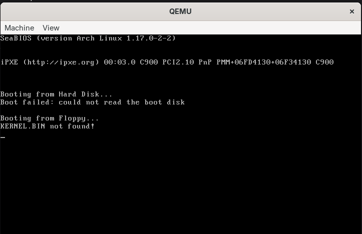
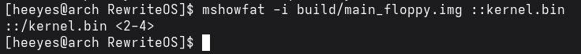
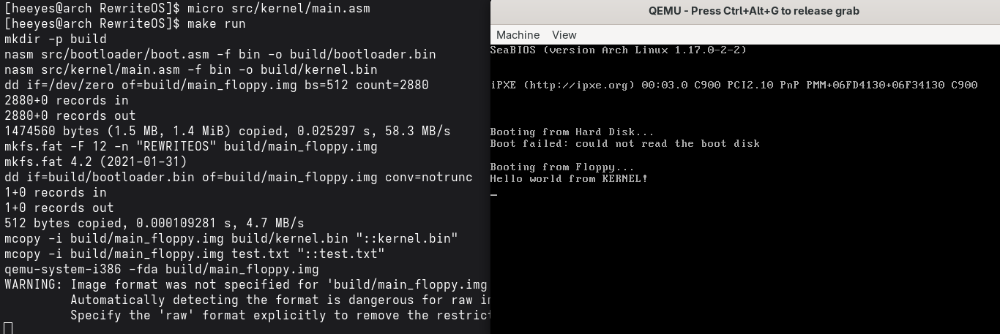
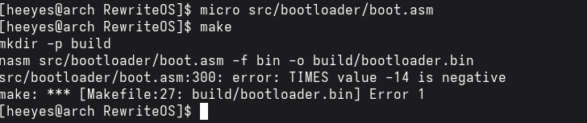

# Jour 5 : le bootloader charge le kernel depuis FAT12 / Day 5: The Bootloader Loads the Kernel from FAT12

[Version Française](#french) | [English Version](#english)

---

##  🇫🇷 Version Française

### Objectif

Traduire en assembleur, dans le boot sector, la logique FAT12 du jour 4 : le bootloader retrouve `kernel.bin` dans le répertoire racine, le charge en mémoire cluster par cluster, puis lui donne la main.

### Résultat

Le message vient maintenant du **kernel**, plus du bootloader : le bootloader a trouvé `kernel.bin` dans l'image FAT12, l'a chargé en mémoire et lui a donné la main.

### Ce que j'ai compris

#### Ce que fait le bootloader, étape par étape
1. **Remettre CS à 0** : certains BIOS lancent le code en `07C0:0000`. Un `push es`, `push word .after`, `retf` force un saut qui met CS à 0.
2. **Mémoriser le lecteur** : le BIOS met le numéro du lecteur dans `dl`, je le range dans `ebr_drive_number`.
3. **Calculer et lire le répertoire racine** : position = réservés + (nombre de FAT × secteurs par FAT) ; taille = (entrées × 32) ÷ octets par secteur, arrondie au supérieur. Je le lis dans `buffer`, juste après le bootloader (adresse `0x7E00`).
4. **Chercher `KERNEL  BIN`** : `repe cmpsb` compare 11 octets entre `ds:si` et `es:di`. Si ça ne correspond pas, on passe à l'entrée suivante (+32 octets). Si on arrive au bout, on affiche `KERNEL.BIN not found!`.
5. **Récupérer le premier cluster** à l'offset 26 de l'entrée.
6. **Lire la table FAT** en mémoire.
7. **Boucle de chargement** : convertir le cluster en secteur, lire 1 cluster, avancer `bx` de 512 octets, chercher le cluster suivant dans la FAT, et recommencer jusqu'à une valeur supérieure ou égale à `0xFF8`.
8. **Sauter dans le kernel** avec un saut lointain vers `0x2000:0000`, après avoir mis `ds` et `es` à `0x2000` et gardé le lecteur dans `dl`.

#### Pourquoi le kernel est chargé à `0x2000:0000` ?
En mode réel, il y a une grande zone libre entre la fin du bootloader (autour de `0x7E00`) et le début de la zone de données du BIOS étendu (`0x80000`). `0x20000` laisse de la place au bootloader et en garde beaucoup pour le kernel. Comme le segment est `0x2000` et l'offset `0`, le kernel est assemblé avec `org 0`.

#### Le lien avec mon programme en C du jour 4
| En C (jour 4) | En assembleur (jour 5) |
|---------------|------------------------|
| `readRootDirectory` | calcul de la position et de la taille, puis `disk_read` |
| `findFile` avec `memcmp` | boucle `.search_kernel` avec `repe cmpsb` |
| `readFile` | boucle `.load_kernel_loop` |
| `fatIndex = cluster * 3 / 2` | `mul`, puis `div`, puis `shr ax, 4` ou `and ax, 0x0FFF` |

#### Les limites que je connais
* `add ax, 31` ne marche que pour une disquette de 1,44 Mo (zone de données au secteur 33, donc secteur = cluster − 2 + 33). Sur un autre type de disque, il faudrait calculer cette valeur.
* `add bx, 512` déborde si le kernel dépasse 64 Ko.
* Il ne me reste que **46 octets libres** dans les 512 du boot sector (le code s'arrête à l'octet 464).

### Mini-exos

#### Exo 1 : pourquoi `+ 31` ?
- **Mon explication :** la zone de données commence au secteur 33 (1 secteur réservé + 18 secteurs de FAT + 14 secteurs de répertoire racine). Le premier cluster de données est le cluster 2, car les clusters 0 et 1 sont réservés. Avec 1 secteur par cluster, le secteur d'un cluster est donc `33 + (cluster − 2)`, ce qui revient à `cluster + 31` puisque 33 − 2 = 31. C'est ce que fait `add ax, 31` dans le bootloader.
- **Vérification :**
  * cluster 2 : 2 + 31 = secteur 33 (début de `kernel.bin`) ;
  * cluster 3 : 3 + 31 = secteur 34, où se trouve `test.txt` quand le kernel tient dans un seul cluster ;
  * cluster 5 : 5 + 31 = secteur 36, comme dans mon calcul du jour 4.
  * Commande : `dd if=build/main_floppy.img bs=512 skip=34 count=1 2>/dev/null | head -c 40` affiche le début de `test.txt`.
- **Pourquoi la valeur est écrite en dur :** le 33 dépend de la taille des zones précédentes, qui n'est vraie que pour une disquette de 1,44 Mo. Sur un autre disque, il faudrait calculer cette valeur au lieu de l'écrire en dur.

#### Exo 2 : lancer le tout
- **Commande :** `make run`
- **Observé :** QEMU affiche `Hello world from KERNEL!` (voir la capture plus haut). Le texte est écrit par le kernel, chargé à `0x2000:0000`.

#### Exo 3 : un kernel absent
- **Commandes :** `mdel -i build/main_floppy.img ::kernel.bin`, puis `qemu-system-i386 -fda build/main_floppy.img`
- **Observé :** `KERNEL.BIN not found!`

- **Pourquoi :** le bootloader parcourt les 224 entrées du répertoire racine et compare chaque nom (11 caractères) avec `KERNEL  BIN`. Aucune ne correspond, donc il affiche l'erreur puis attend une touche pour redémarrer.

#### Exo 4 : un kernel de plusieurs clusters
- **Modification :** dans `src/kernel/main.asm`, ajouter `times 1200-($-$$) db 0` juste avant la ligne `msg_hello`, puis `make run`, puis `mshowfat -i build/main_floppy.img ::kernel.bin`
- **Clusters observés :** `<2-4>`, donc 3 clusters.

- **Le message s'affiche-t-il ?** Oui, `Hello world from KERNEL!` s'affiche.

- **Pourquoi c'est un bon test :** le message est écrit vers l'octet 1200 du kernel, donc dans son 3e cluster (octets 1024 à 1535). S'il s'affiche, c'est que le bootloader a bien suivi toute la chaîne de la table FAT (2, 3, puis 4). Les clusters se suivent parce que `kernel.bin` est copié en premier dans une image vide.

#### Exo 5 : les 512 octets
- **Modification :** dans `boot.asm`, ajouter `times 60 db 0` juste avant `times 510-($-$$) db 0`, puis `make`
- **Observé :** `error: TIMES value -14 is negative`

- **Pourquoi :** mon code occupe 464 octets, donc il reste 510 − 464 = 46 octets avant la signature `0xAA55`. Avec 60 octets de plus, je dépasse de 14 octets : NASM calcule `510-($-$$)` = −14 et refuse de remplir avec un nombre négatif de zéros. Ça prouve que les 512 octets du boot sector sont presque pleins.

### Erreurs rencontrées

| Erreur / symptôme | Cause | Solution |
|-------------------|-------|----------|
| `error: TIMES value -14 is negative` | le code dépasse 510 octets (exo 5) | retirer du code ou factoriser, c'est la limite du boot sector |

---

##  🇬🇧 English Version

### Goal

Translate the day 4 FAT12 logic into assembly inside the boot sector: the bootloader finds `kernel.bin` in the root directory, loads it into memory cluster by cluster, then hands over control.

### Result

The message now comes from the **kernel**, not from the bootloader: the bootloader found `kernel.bin` in the FAT12 image, loaded it into memory and handed over control.

### What I understood

#### What the bootloader does, step by step
1. **Reset CS to 0**: some BIOSes start the code at `07C0:0000`. `push es`, `push word .after`, `retf` forces a jump that sets CS to 0.
2. **Remember the drive**: the BIOS puts the drive number in `dl`; I store it in `ebr_drive_number`.
3. **Compute and read the root directory**: position = reserved sectors + (number of FATs × sectors per FAT); size = (entries × 32) ÷ bytes per sector, rounded up. I read it into `buffer`, right after the bootloader (address `0x7E00`).
4. **Search for `KERNEL  BIN`**: `repe cmpsb` compares 11 bytes between `ds:si` and `es:di`. If they differ, move on to the next entry (+32 bytes). If we run out of entries, print `KERNEL.BIN not found!`.
5. **Get the first cluster** at offset 26 of the entry.
6. **Read the FAT table** into memory.
7. **Loading loop**: convert the cluster to a sector, read 1 cluster, advance `bx` by 512 bytes, look up the next cluster in the FAT, and repeat until a value greater than or equal to `0xFF8`.
8. **Jump into the kernel** with a far jump to `0x2000:0000`, after setting `ds` and `es` to `0x2000` and keeping the drive in `dl`.

#### Why is the kernel loaded at `0x2000:0000`?
In real mode there is a large free area between the end of the bootloader (around `0x7E00`) and the start of the extended BIOS data area (`0x80000`). `0x20000` leaves room for the bootloader and keeps plenty for the kernel. Since the segment is `0x2000` and the offset is `0`, the kernel is assembled with `org 0`.

#### Link with my day 4 C program
| In C (day 4) | In assembly (day 5) |
|--------------|---------------------|
| `readRootDirectory` | computing the position and size, then `disk_read` |
| `findFile` with `memcmp` | `.search_kernel` loop with `repe cmpsb` |
| `readFile` | `.load_kernel_loop` loop |
| `fatIndex = cluster * 3 / 2` | `mul`, then `div`, then `shr ax, 4` or `and ax, 0x0FFF` |

#### Limitations I know about
* `add ax, 31` only works for a 1.44 MB floppy (data region at sector 33, so sector = cluster − 2 + 33). On another disk type, this value would have to be computed.
* `add bx, 512` overflows if the kernel is larger than 64 KB.
* Only **46 free bytes** are left in the 512 of the boot sector (the code ends at byte 464).

### Mini-exercises

#### Exercise 1: why `+ 31`?
- **My explanation:** the data region starts at sector 33 (1 reserved sector + 18 FAT sectors + 14 root directory sectors). The first data cluster is cluster 2, because clusters 0 and 1 are reserved. With 1 sector per cluster, the sector of a cluster is `33 + (cluster − 2)`, which equals `cluster + 31` since 33 − 2 = 31. This is what `add ax, 31` does in the bootloader.
- **Check:**
  * cluster 2: 2 + 31 = sector 33 (start of `kernel.bin`);
  * cluster 3: 3 + 31 = sector 34, where `test.txt` is when the kernel fits in a single cluster;
  * cluster 5: 5 + 31 = sector 36, as in my day 4 calculation.
  * Command: `dd if=build/main_floppy.img bs=512 skip=34 count=1 2>/dev/null | head -c 40` shows the start of `test.txt`.
- **Why the value is hard-coded:** the 33 depends on the sizes of the preceding areas, which is only true for a 1.44 MB floppy. On another disk, this value would have to be computed instead of hard-coded.

#### Exercise 2: running it
- **Command:** `make run`
- **Observed:** QEMU displays `Hello world from KERNEL!` (see the screenshot above). The text is written by the kernel, loaded at `0x2000:0000`.

#### Exercise 3: a missing kernel
- **Commands:** `mdel -i build/main_floppy.img ::kernel.bin`, then `qemu-system-i386 -fda build/main_floppy.img`
- **Observed:** `KERNEL.BIN not found!`

- **Why:** the bootloader goes through the 224 root directory entries and compares each name (11 characters) with `KERNEL  BIN`. None matches, so it prints the error and waits for a key to reboot.

#### Exercise 4: a multi-cluster kernel
- **Change:** in `src/kernel/main.asm`, add `times 1200-($-$$) db 0` just before the `msg_hello` line, then `make run`, then `mshowfat -i build/main_floppy.img ::kernel.bin`
- **Clusters observed:** `<2-4>`, i.e. 3 clusters.

- **Does the message show up?** Yes, `Hello world from KERNEL!` is displayed.

- **Why this is a good test:** the message is written around byte 1200 of the kernel, i.e. in its 3rd cluster (bytes 1024 to 1535). If it shows up, the bootloader followed the whole FAT chain (2, 3, then 4). The clusters are consecutive because `kernel.bin` is copied first into an empty image.

#### Exercise 5: the 512 bytes
- **Change:** in `boot.asm`, add `times 60 db 0` just before `times 510-($-$$) db 0`, then `make`
- **Observed:** `error: TIMES value -14 is negative`

- **Why:** my code takes 464 bytes, so 510 − 464 = 46 bytes remain before the `0xAA55` signature. With 60 extra bytes, I overflow by 14: NASM computes `510-($-$$)` = −14 and refuses to pad with a negative number of zeros. It shows that the 512 bytes of the boot sector are almost full.

### Errors encountered

| Error / symptom | Cause | Solution |
|-----------------|-------|----------|
| `error: TIMES value -14 is negative` | the code goes beyond 510 bytes (exercise 5) | remove or factor code, this is the boot sector limit |
