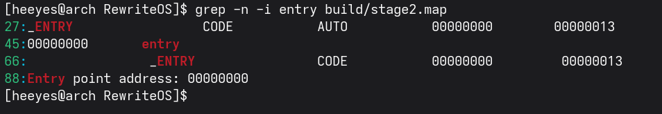
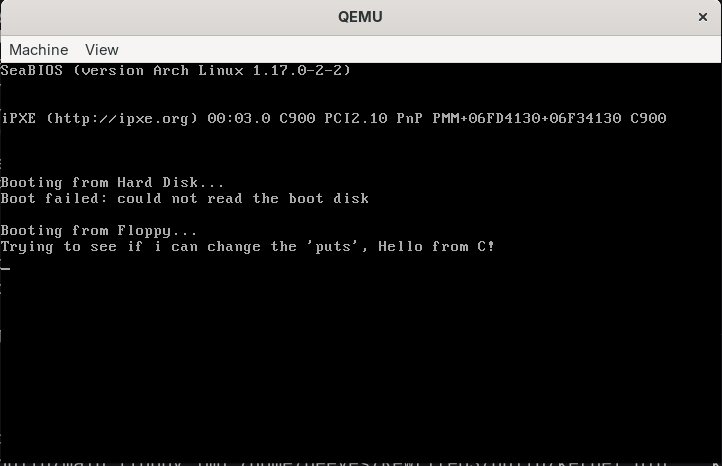
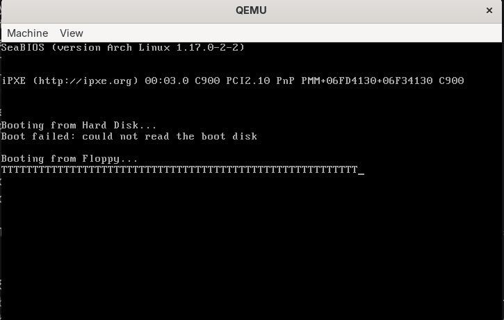

# Jour 6 : la stage 2 du bootloader en C / Day 6: Writing Stage 2 of the Bootloader in C

[Version Française](#french) | [English Version](#english)

---

##  🇫🇷 Version Française

### Objectif

Séparer le bootloader en deux étapes (stage 1 en assembleur, stage 2 en C), installer le compilateur Open Watcom, et afficher un message depuis du code C.

### Résultat

Le message est maintenant écrit par du code **C** (`puts`), chargé par la stage 1 depuis le fichier `stage2.bin` de la disquette.

### Ce que j'ai compris

#### Pourquoi deux étapes ?
Le boot sector ne fait que 512 octets : il ne reste que 46 octets libres. La **stage 1** (dans le boot sector) ne fait qu'une chose : chercher `stage2.bin` dans le répertoire racine FAT12 et le charger. La **stage 2** n'a plus la limite des 512 octets : on peut y écrire en C, et plus tard y faire passer le processeur en mode 32 bits.

#### Pourquoi le C, et pourquoi Open Watcom ?
Le C n'a pas besoin de support à l'exécution (pas de bibliothèque obligatoire), il est utilisé par la plupart des systèmes d'exploitation et il donne le contrôle de la mémoire. Mais on est encore en **mode réel 16 bits**, et GCC et Clang ne savent pas produire ce code. Open Watcom sait le faire, et il tourne sous Linux.

#### Les options de compilation (`wcc`)
* `-4` : code compatible avec un processeur 486 ou plus récent.
* `-d3` : beaucoup d'informations de débogage.
* `-s` : désactive la vérification de débordement de pile (on n'a pas de runtime pour la faire).
* `-wx` : tous les avertissements.
* `-ms` : modèle mémoire « small ».
* `-zl` : ne pas référencer les bibliothèques standard (on n'y a pas accès).
* `-zq` : silencieux, n'affiche que les avertissements et erreurs.

#### Les modèles mémoire
En mode réel, une adresse est `segment:offset`. Un pointeur « near » ne contient que l'offset (16 bits), un pointeur « far » contient les deux (32 bits). Le modèle **small** utilise deux segments (un pour le code, un pour les données et la pile) avec des pointeurs near par défaut : c'est le plus simple, et le bootloader n'est pas gros. Les autres (tiny, medium, compact, large, huge) mélangent near et far pour gérer plus de code ou plus de données, au prix de la vitesse et de la complexité.

#### Le script d'édition de liens (`linker.lnk`)
On veut que le premier octet de `stage2.bin` soit directement le point d'entrée, sans en-tête. D'où `FORMAT RAW BIN`, `OPTION START=entry`, `OPTION OFFSET=0` (l'équivalent de `org`, car le fichier est chargé à l'offset 0 du segment `0x2000`) et `ORDER` qui place d'abord le segment `_ENTRY`, puis `_TEXT`, puis les données. Dans le fichier `.map`, l'adresse du point d'entrée doit être **0**, sinon quelque chose ne va pas.

#### La convention d'appel cdecl
* Les paramètres sont empilés **de droite à gauche**.
* Un entier ou une adresse est retourné dans `ax`.
* L'appelant retire les paramètres de la pile après l'appel.
* Les registres `eax`, `ecx`, `edx` sont sauvegardés par l'appelant, les autres par la fonction appelée.
* Le nom des fonctions commence par un `_` (d'où `_cstart_` en assembleur pour la fonction C `cstart_`).

Dans une fonction (modèle small, appel near) : `[bp]` est l'ancien `bp`, `[bp+2]` l'adresse de retour, `[bp+4]` le 1er argument, `[bp+6]` le 2e.

#### Mélanger C et assembleur
Le C ne peut pas appeler une interruption BIOS. J'écris donc en assembleur `x86_Video_WriteCharTeletype` (qui fait `int 10h` avec `ah = 0Eh`), et `putc` et `puts` en C l'appellent.

### Mini-exos

#### Exo 1 : installer Open Watcom
- **Commandes utilisées :** téléchargement de `ow-snapshot.tar.xz` (la version précompilée d'Open Watcom) avec `curl`, puis extraction avec `sudo tar xf ow-snapshot.tar.xz -C /opt/watcom`.
- **Vérification :** `/opt/watcom/binl64/wcc | head -3` affiche la bannière `Open Watcom C x86 16-bit Optimizing Compiler`, version 2.0 beta (64-bit). Le compilateur est donc bien installé.

#### Exo 2 : lancer le tout
- **Commande :** `make run`
- **Observé :** QEMU affiche `Hello world from C!` (voir la capture plus haut). Le `Warning! W1014: stack segment not found` du linker n'empêche rien.

#### Exo 3 : lire le fichier `.map`
- **Commande :** `grep -n -i entry build/stage2.map`
- **Adresse du point d'entrée :** `00000000`.

- **Taille de `stage2.bin` :** `Memory size: 00a6`, soit 0xA6 = 166 octets.
- **Ce que ça veut dire :** le segment `_ENTRY` est tout au début du fichier (adresse 0), donc la stage 1 peut sauter directement sur le premier octet de `stage2.bin` sans lire d'en-tête. `_cstart_` est à `0x26`, `_putc` à `0x3f` et `_puts` à `0x5d`.

#### Exo 4 : modifier le message
- **Modification :** changer le texte de `puts` dans `main.c` et ajouter une deuxième ligne
- **Observé :** QEMU affiche mon nouveau texte : `Trying to see if i can change the 'puts', Hello from C!`

- **Ce que ça montre :** le texte vient bien du code C que je viens de recompiler, pas d'un ancien fichier.

#### Exo 5 : l'erreur de la vidéo
- **Modification :** dans `x86.asm`, remplacer `[bp + 4]` par `[bp + 2]`, puis `make run`
- **Observé :** l'écran se remplit de la lettre `T`, une lettre `T` pour chaque caractère du texte.

- **Pourquoi :** `[bp + 2]` n'est pas le caractère à afficher, c'est l'**adresse de retour** de la fonction (voir la pile : `[bp]` ancien `bp`, `[bp+2]` adresse de retour, `[bp+4]` 1er argument). Le `call` est dans `putc` et revient à l'adresse `0x54` ; son octet de poids faible `0x54` est le code ASCII de la lettre `T`. Chaque appel affiche donc `T`, quel que soit le caractère demandé. Même les retours à la ligne `\r\n` sont remplacés par des `T`, c'est pourquoi tout reste sur la même ligne.

### Erreurs rencontrées

| Erreur / symptôme | Cause | Solution |
|-------------------|-------|----------|
| `Warning! W1014: stack segment not found` | l'éditeur de liens ne trouve pas de segment de pile explicite | sans gravité ici, la vidéo le signale aussi |
| Une ligne de `T` à la place du texte | `[bp + 2]` lu au lieu de `[bp + 4]` : on lit l'adresse de retour au lieu de l'argument (exo 5) | revenir à `[bp + 4]` |

---

##  🇬🇧 English Version

### Goal

Split the bootloader into two stages (stage 1 in assembly, stage 2 in C), install the Open Watcom compiler, and print a message from C code.

### Result

The message is now written by **C** code (`puts`), loaded by stage 1 from the `stage2.bin` file on the floppy.

### What I understood

#### Why two stages?
The boot sector is only 512 bytes: just 46 free bytes remain. **Stage 1** (in the boot sector) does only one thing: find `stage2.bin` in the FAT12 root directory and load it. **Stage 2** is no longer limited to 512 bytes: it can be written in C, and later it will switch the processor to 32-bit mode.

#### Why C, and why Open Watcom?
C needs no runtime support (no mandatory library), it is used by most operating systems and it gives control over memory. But we are still in **16-bit real mode**, and GCC and Clang cannot produce that code. Open Watcom can, and it runs on Linux.

#### The compile options (`wcc`)
* `-4`: code compatible with a 486 or newer processor.
* `-d3`: lots of debugging information.
* `-s`: disables stack overflow checks (there is no runtime to do them).
* `-wx`: all warnings.
* `-ms`: "small" memory model.
* `-zl`: do not reference the standard libraries (we have no access to them).
* `-zq`: quiet, prints only warnings and errors.

#### Memory models
In real mode, an address is `segment:offset`. A "near" pointer holds only the offset (16 bits), a "far" pointer holds both (32 bits). The **small** model uses two segments (one for code, one for data and stack) with near pointers by default: it is the simplest, and the bootloader is not big. The others (tiny, medium, compact, large, huge) mix near and far to handle more code or more data, at the cost of speed and complexity.

#### The linker script (`linker.lnk`)
I want the first byte of `stage2.bin` to be the entry point itself, with no header. Hence `FORMAT RAW BIN`, `OPTION START=entry`, `OPTION OFFSET=0` (the equivalent of `org`, since the file is loaded at offset 0 of segment `0x2000`) and `ORDER`, which places the `_ENTRY` segment first, then `_TEXT`, then the data. In the `.map` file, the entry point address must be **0**, otherwise something is wrong.

#### The cdecl calling convention
* Parameters are pushed **from right to left**.
* An integer or an address is returned in `ax`.
* The caller removes the parameters from the stack after the call.
* Registers `eax`, `ecx`, `edx` are saved by the caller, the others by the called function.
* Function names start with `_` (hence `_cstart_` in assembly for the C function `cstart_`).

Inside a function (small model, near call): `[bp]` is the old `bp`, `[bp+2]` the return address, `[bp+4]` the 1st argument, `[bp+6]` the 2nd.

#### Mixing C and assembly
C cannot call a BIOS interrupt. So I wrote `x86_Video_WriteCharTeletype` in assembly (it does `int 10h` with `ah = 0Eh`), and `putc` and `puts` in C call it.

### Mini-exercises

#### Exercise 1: installing Open Watcom
- **Commands used:** downloaded `ow-snapshot.tar.xz` (the prebuilt Open Watcom) with `curl`, then extracted it with `sudo tar xf ow-snapshot.tar.xz -C /opt/watcom`.
- **Check:** `/opt/watcom/binl64/wcc | head -3` prints the banner `Open Watcom C x86 16-bit Optimizing Compiler`, version 2.0 beta (64-bit). The compiler is installed.

#### Exercise 2: running it
- **Command:** `make run`
- **Observed:** QEMU displays `Hello world from C!` (see the screenshot above). The linker's `Warning! W1014: stack segment not found` does not prevent anything.

#### Exercise 3: reading the `.map` file
- **Command:** `grep -n -i entry build/stage2.map`
- **Entry point address:** `00000000`.

- **Size of `stage2.bin`:** `Memory size: 00a6`, i.e. 0xA6 = 166 bytes.
- **What it means:** the `_ENTRY` segment is at the very start of the file (address 0), so stage 1 can jump straight to the first byte of `stage2.bin` without reading any header. `_cstart_` is at `0x26`, `_putc` at `0x3f` and `_puts` at `0x5d`.

#### Exercise 4: changing the message
- **Change:** edit the text passed to `puts` in `main.c` and add a second line
- **Observed:** QEMU displays my new text: `Trying to see if i can change the 'puts', Hello from C!`

- **What it shows:** the text really comes from the C code I just recompiled, not from an old file.

#### Exercise 5: the video's bug
- **Change:** in `x86.asm`, replace `[bp + 4]` with `[bp + 2]`, then `make run`
- **Observed:** the screen fills with the letter `T`, one `T` for each character of the text.

- **Why:** `[bp + 2]` is not the character to print, it is the function's **return address** (see the stack: `[bp]` old `bp`, `[bp+2]` return address, `[bp+4]` 1st argument). The `call` is inside `putc` and returns to address `0x54`; its low byte `0x54` is the ASCII code of the letter `T`. Every call therefore prints `T`, whatever character was requested. Even the `\r\n` line breaks are replaced by `T`s, which is why everything stays on the same line.

### Errors encountered

| Error / symptom | Cause | Solution |
|-----------------|-------|----------|
| `Warning! W1014: stack segment not found` | the linker finds no explicit stack segment | harmless here, the video mentions it too |
| A line of `T`s instead of the text | `[bp + 2]` read instead of `[bp + 4]`: the return address is read instead of the argument (exercise 5) | go back to `[bp + 4]` |
