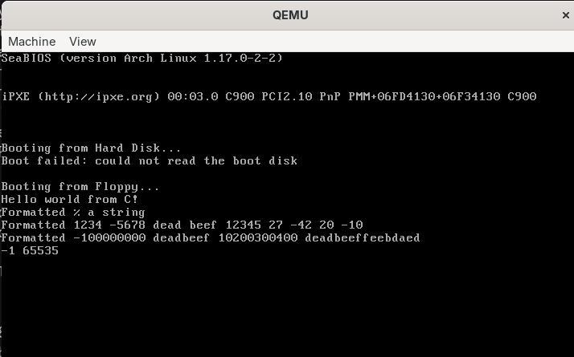
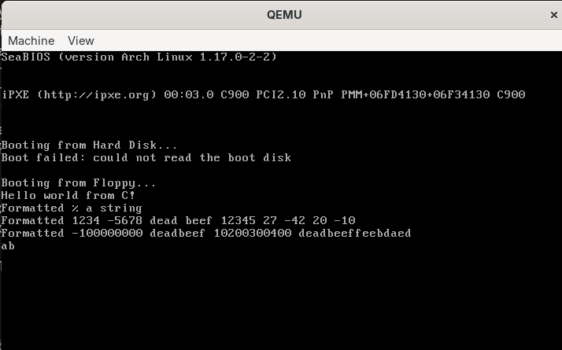

# Jour 7 : écrire `printf` sans bibliothèque / Day 7: Writing `printf` Without a Library

[Version Française](#french) | [English Version](#english)

---

## <a id="french"></a> 🇫🇷 Version Française

### Objectif

Écrire ma propre fonction `printf` dans la stage 2 : lire un nombre variable d'arguments sur la pile, analyser le format avec une machine à états, afficher des nombres dans plusieurs bases, et contourner l'absence de division 64 bits en mode 16 bits.

### Résultat


Mon `printf` affiche bien les chaînes, les caractères, les entiers signés et non signés, l'hexadécimal, l'octal, et même les nombres sur 64 bits.

### Ce que j'ai compris

#### Les arguments variables sur la pile (cdecl)
Les arguments sont empilés de droite à gauche, donc le premier (`fmt`) est toujours à `[bp+4]`, quel que soit le nombre d'arguments. En C, je prends l'adresse de `fmt` (`argp = (int*) &fmt`) et j'avance d'un mot (`argp++`) pour arriver au 2e argument. Chaque argument est aligné sur la taille d'un `int` (2 octets en mode réel 16 bits) : un `char` ou un `short` occupe donc 1 mot, un `long` 2 mots et un `long long` 4 mots.

#### La machine à états qui lit le format
On part de l'état `NORMAL` : tout caractère autre que `%` est affiché. Un `%` mène à l'état `LENGTH`. Là, `h` ou `l` indiquent une longueur (`hh`, `h`, `l`, `ll` avec les états `SHORT` et `LONG`), sinon on passe directement à `SPEC`. Dans l'état `SPEC`, la lettre dit quoi faire : `c` (caractère), `s` (chaîne), `d` et `i` (entier signé), `u` (non signé), `x` et `p` (hexadécimal), `o` (octal), `%`. Un spécificateur inconnu est simplement ignoré. Ensuite on revient à `NORMAL`.

#### Afficher un nombre dans une base
On divise le nombre par la base ; le **reste** est un chiffre, qu'on cherche dans `"0123456789abcdef"`. On répète jusqu'à ce que le nombre soit 0. Les chiffres sortent à l'envers, donc on les stocke dans un tampon et on l'affiche en sens inverse. Pour un nombre négatif, on retient le signe, on prend la valeur absolue et on ajoute `-` à la fin.

#### Pourquoi une division en assembleur ?
En mode réel, le processeur sait diviser au maximum un nombre de 64 bits par un nombre de 32 bits, et le quotient doit tenir dans 32 bits, sinon c'est une exception. Le compilateur, lui, essaie de diviser 64 bits par 64 bits, et appelle une fonction de sa bibliothèque (`__U8DR`) qu'on n'a pas (`-zl`), d'où l'erreur de l'éditeur de liens.

#### La division longue
On coupe le dividende en deux moitiés de 32 bits. 1) On divise la moitié haute : on obtient la moitié haute du quotient et un reste. 2) On colle ce reste devant la moitié basse et on divise encore : on obtient la moitié basse du quotient et le reste final. C'est la division posée de l'école, mais en base 2³². C'est ce que fait `x86_div64_32` : deux instructions `div`, avec les paramètres lus sur la pile (`[bp+4]`, `[bp+8]`, `[bp+12]`, `[bp+16]`, `[bp+18]`).

### Mini-exos

#### Exo 1 : lancer le tout
- **Commande :** `make run`
- **Observé :** les trois lignes `Formatted ...` s'affichent exactement comme dans la vidéo (voir la capture plus haut), y compris `-100000000`, `deadbeef`, `10200300400` et `deadbeeffeebdaed`.

#### Exo 2 : prévoir avant de lancer
- **Test :** `printf("%d %u\r\n", -1, -1);` dans `main.c`
- **Ma prévision :** `-1 65535`
- **Observé :** `-1 65535`



- **Pourquoi :** en mode réel, un `int` fait 16 bits, donc `-1` est stocké `0xFFFF`. Avec `%d`, `printf` lit ces 16 bits comme un nombre signé et affiche `-1`. Avec `%u`, il lit exactement les mêmes bits comme un nombre non signé : 2¹⁶ − 1 = `65535`. Seule l'interprétation change, pas les bits.

#### Exo 3 : dessiner la pile (sur papier)
- **Appel :** `printf("%d %s\r\n", 7, "hi");`
- **Ce qui se passe à l'appel :** l'appelant empile les arguments de droite à gauche (d'abord le pointeur de `"hi"`, puis `7`, puis `fmt`), puis `call` empile l'adresse de retour. À l'arrivée dans `printf`, une fois `push bp` et `mov bp, sp` faits comme dans mes fonctions en assembleur, j'ai en mode réel 16 bits (1 mot = 2 octets) :

```
adresses hautes
   [bp + 8]  pointeur vers "hi"      (3e argument)
   [bp + 6]  7                       (2e argument)
   [bp + 4]  fmt                     (1er argument)
   [bp + 2]  adresse de retour       (poussée par call, 2 octets)
   [bp + 0]  ancien bp
adresses basses
```
- **Où pointe `argp` :** au début, `argp = &fmt`, donc `[bp+4]`. Après `argp++`, il pointe sur `7` (`[bp+6]`). Le `%d` lit `7`, puis `printf_number` fait avancer `argp` d'un mot, donc il pointe sur le pointeur de `"hi"` (`[bp+8]`), que le `%s` va lire.
- **Après l'appel :** c'est l'appelant qui retire les 3 mots de la pile (`add sp, 6`), c'est la règle de cdecl.
- **À retenir :** en mode protégé 32 bits, plus tard, les mêmes cases feront 4 octets : `fmt` sera à `[ebp+8]`, puis `[ebp+12]`, `[ebp+16]`. Dans du code C compilé, le compilateur peut aussi empiler d'autres registres avant `bp` (on l'a vu dans `putc`, où l'argument est à `[bp+8]`), donc ces décalages valent pour mes fonctions écrites à la main en assembleur.

#### Exo 4 : la division longue à la main
- **Calcul :** diviser `0x1111222233334444` par `0x123` en deux étapes de 32 bits, comme dans la vidéo, puis vérifier avec Python (`divmod`)
- **1re division :** `0x11112222 ÷ 0x123` = `0xF03A2` reste `0xFC` (252). Je divise d'abord la moitié haute, en mettant `edx = 0` avant le `div`.
- **2e division :** le reste devient la moitié haute : `0xFC_33334444 ÷ 0x123` = `0xDDDDDDEC` reste `0x100` (256). Dans le code, `edx` contient déjà l'ancien reste, je n'ai donc pas à le remettre à zéro.
- **Résultat final :** quotient = `0xF03A2` suivi de `DDDDDDEC`, soit `0xF03A2DDDDDDEC`, et reste = `0x100`.
- **Vérification avec Python :** `divmod(0x1111222233334444, 0x123)` donne `(0xf03a2ddddddec, 0x100)`. Et `0x123 × 0xf03a2ddddddec + 0x100 = 0x1111222233334444`.
- **Pourquoi deux divisions :** `div` ne sait diviser qu'un nombre de 64 bits (`edx:eax`) par 32 bits, et le quotient doit tenir dans 32 bits. Ici le quotient (environ 4,2 × 10¹⁵) ne tient pas : une seule division provoquerait une exception de division. En coupant en deux, chaque quotient partiel tient dans 32 bits. La 2e division ne peut pas déborder, car le reste de la 1re est toujours plus petit que le diviseur.
- **Piège repéré :** `0xDDDDDDEC` vaut 3 722 305 004, pas `0xDDDDDBEC` (3 722 304 492). Quand je convertis de décimal en hexadécimal, je vérifie avec Python.

#### Exo 5 : un spécificateur invalide
- **Test :** `printf("a%zb\r\n");`
- **Observé :** `ab`



- **Pourquoi :** après le `%`, le `z` n'est ni une longueur (`h` ou `l`), donc on passe à l'état `SPEC`, où il ne correspond à aucun cas. Le `default` ignore ce spécificateur, l'état revient à `NORMAL`, et le `b` suivant est affiché normalement. Le `%z` disparaît donc sans afficher d'erreur, et aucun argument n'est consommé.

### Erreurs rencontrées

| Erreur / symptôme | Cause | Solution |
|-------------------|-------|----------|
| Quotient `0xF03A2DDDDDBEC` au lieu de `0xF03A2DDDDDDEC` (exo 4) | erreur en convertissant le décimal 3 722 305 004 en hexadécimal | refaire le calcul avec Python (`hex(q)`) |

---

## <a id="english"></a> 🇬🇧 English Version

### Goal

Write my own `printf` in stage 2: read a variable number of arguments from the stack, parse the format with a state machine, print numbers in several bases, and work around the lack of 64-bit division in 16-bit mode.

### Result


My `printf` correctly prints strings, characters, signed and unsigned integers, hexadecimal, octal, and even 64-bit numbers.

### What I understood

#### Variable arguments on the stack (cdecl)
Arguments are pushed from right to left, so the first one (`fmt`) is always at `[bp+4]`, whatever the number of arguments. In C, I take the address of `fmt` (`argp = (int*) &fmt`) and move forward one word (`argp++`) to reach the 2nd argument. Each argument is aligned to the size of an `int` (2 bytes in 16-bit real mode): a `char` or a `short` takes 1 word, a `long` takes 2 and a `long long` takes 4.

#### The state machine that reads the format
We start in the `NORMAL` state: any character other than `%` is printed. A `%` leads to the `LENGTH` state. There, `h` or `l` give a length (`hh`, `h`, `l`, `ll` using the `SHORT` and `LONG` states), otherwise we go straight to `SPEC`. In the `SPEC` state, the letter says what to do: `c` (character), `s` (string), `d` and `i` (signed integer), `u` (unsigned), `x` and `p` (hexadecimal), `o` (octal), `%`. An unknown specifier is simply ignored. Then we go back to `NORMAL`.

#### Printing a number in a base
Divide the number by the base; the **remainder** is a digit, looked up in `"0123456789abcdef"`. Repeat until the number is 0. The digits come out backwards, so they are stored in a buffer and printed in reverse order. For a negative number, remember the sign, take the absolute value and add `-` at the end.

#### Why a division in assembly?
In real mode, the processor can divide at most a 64-bit number by a 32-bit number, and the quotient must fit in 32 bits, otherwise it raises an exception. The compiler tries to divide 64 bits by 64 bits and calls a function from its library (`__U8DR`) that we do not have (`-zl`), hence the linker error.

#### Long division
Split the dividend into two 32-bit halves. 1) Divide the high half: you get the high half of the quotient and a remainder. 2) Put that remainder in front of the low half and divide again: you get the low half of the quotient and the final remainder. It is school long division, but in base 2³². This is what `x86_div64_32` does: two `div` instructions, with the parameters read from the stack (`[bp+4]`, `[bp+8]`, `[bp+12]`, `[bp+16]`, `[bp+18]`).

### Mini-exercises

#### Exercise 1: running it
- **Command:** `make run`
- **Observed:** the three `Formatted ...` lines are displayed exactly as in the video (see the screenshot above), including `-100000000`, `deadbeef`, `10200300400` and `deadbeeffeebdaed`.

#### Exercise 2: predict before running
- **Test:** `printf("%d %u\r\n", -1, -1);` in `main.c`
- **My prediction:** `-1 65535`
- **Observed:** `-1 65535`


- **Why:** in real mode, an `int` is 16 bits, so `-1` is stored as `0xFFFF`. With `%d`, `printf` reads those 16 bits as a signed number and prints `-1`. With `%u`, it reads exactly the same bits as an unsigned number: 2¹⁶ − 1 = `65535`. Only the interpretation changes, not the bits.

#### Exercise 3: drawing the stack (on paper)
- **Call:** `printf("%d %s\r\n", 7, "hi");`
- **What happens at the call:** the caller pushes the arguments from right to left (first the pointer to `"hi"`, then `7`, then `fmt`), then `call` pushes the return address. On entering `printf`, once `push bp` and `mov bp, sp` are done as in my assembly functions, I have in 16-bit real mode (1 word = 2 bytes):

```
high addresses
   [bp + 8]  pointer to "hi"         (3rd argument)
   [bp + 6]  7                       (2nd argument)
   [bp + 4]  fmt                     (1st argument)
   [bp + 2]  return address          (pushed by call, 2 bytes)
   [bp + 0]  old bp
low addresses
```
- **Where `argp` points:** at first, `argp = &fmt`, i.e. `[bp+4]`. After `argp++`, it points to `7` (`[bp+6]`). The `%d` reads `7`, then `printf_number` moves `argp` forward one word, so it points to the pointer to `"hi"` (`[bp+8]`), which the `%s` is going to read.
- **After the call:** the caller removes the 3 words from the stack (`add sp, 6`), this is the cdecl rule.
- **To remember:** in 32-bit protected mode, later on, the same slots will be 4 bytes: `fmt` will be at `[ebp+8]`, then `[ebp+12]`, `[ebp+16]`. In compiled C code, the compiler may also push other registers before `bp` (we saw it in `putc`, where the argument is at `[bp+8]`), so these offsets apply to my hand-written assembly functions.

#### Exercise 4: long division by hand
- **Calculation:** divide `0x1111222233334444` by `0x123` in two 32-bit steps, as in the video, then check with Python (`divmod`)
- **1st division:** `0x11112222 ÷ 0x123` = `0xF03A2` remainder `0xFC` (252). I divide the high half first, with `edx = 0` before the `div`.
- **2nd division:** the remainder becomes the high half: `0xFC_33334444 ÷ 0x123` = `0xDDDDDDEC` remainder `0x100` (256). In the code, `edx` already holds the old remainder, so I must not clear it.
- **Final result:** quotient = `0xF03A2` followed by `DDDDDDEC`, i.e. `0xF03A2DDDDDDEC`, and remainder = `0x100`.
- **Check with Python:** `divmod(0x1111222233334444, 0x123)` gives `(0xf03a2ddddddec, 0x100)`. And `0x123 × 0xf03a2ddddddec + 0x100 = 0x1111222233334444`.
- **Why two divisions:** `div` can only divide a 64-bit number (`edx:eax`) by 32 bits, and the quotient must fit in 32 bits. Here the quotient (about 4.2 × 10¹⁵) does not fit: a single division would raise a divide exception. Splitting in two, each partial quotient fits in 32 bits. The 2nd division cannot overflow, because the remainder of the 1st is always smaller than the divisor.
- **Pitfall spotted:** `0xDDDDDDEC` is 3,722,305,004, not `0xDDDDDBEC` (3,722,304,492). When I convert from decimal to hexadecimal, I check with Python.

#### Exercise 5: an invalid specifier
- **Test:** `printf("a%zb\r\n");`
- **Observed:** `ab`


- **Why:** after the `%`, the `z` is not a length (`h` or `l`), so we move to the `SPEC` state, where it matches no case. The `default` ignores this specifier, the state goes back to `NORMAL`, and the following `b` is printed normally. So the `%z` disappears without any error, and no argument is consumed.

### Errors encountered

| Error / symptom | Cause | Solution |
|-----------------|-------|----------|
| Quotient `0xF03A2DDDDDBEC` instead of `0xF03A2DDDDDDEC` (exercise 4) | mistake when converting decimal 3,722,305,004 to hexadecimal | redo the calculation with Python (`hex(q)`) |
