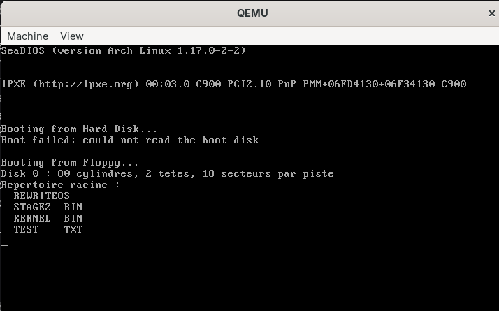
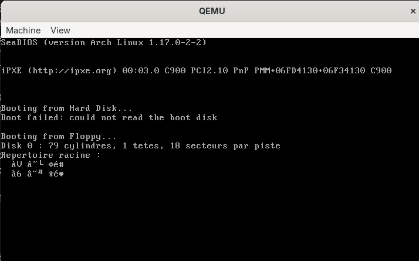
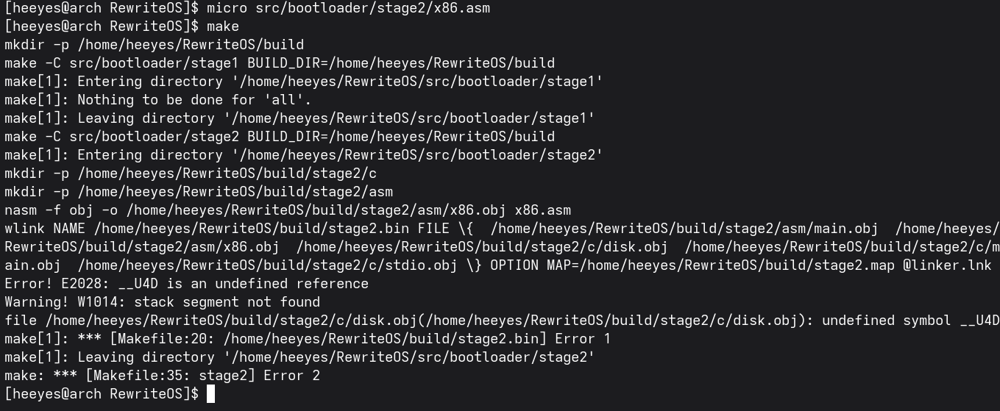

# Jour 8 : lire le disque depuis le C (la couche DISK) / Day 8: Reading the Disk from C (the DISK layer)

[Version Française](#french) | [English Version](#english)

---

##  🇫🇷 Version Française

### Objectif

Donner à la stage 2 (écrite en C) ses propres fonctions de lecture de disque, sans passer par la stage 1 : des enveloppes en assembleur autour de `int 0x13`, une structure `DISK`, la conversion LBA vers CHS en C, et les deux petites fonctions que le compilateur demande pour les calculs sur 32 bits.

### Résultat

La stage 2 lit maintenant le disque toute seule : elle affiche la géométrie (80 cylindres, 2 têtes, 18 secteurs par piste), puis les noms du répertoire racine (`REWRITEOS`, `STAGE2  BIN`, `KERNEL  BIN`, `TEST    TXT`).

### Ce que j'ai compris

#### Une interface simple pour le disque
Celui qui utilise ces fonctions ne veut rien savoir du fonctionnement interne du disque. Je regroupe donc tout ce qui concerne un disque dans une structure `DISK` (numéro du lecteur, nombre de cylindres, de têtes et de secteurs) que je passe à chaque fonction. Rien n'est global, donc on pourrait aussi accéder à plusieurs disques. Deux fonctions : `DISK_Initialize` et `DISK_ReadSectors`.

#### Pourquoi des fonctions en assembleur ?
Le C ne sait pas appeler une interruption du processeur. J'écris donc trois enveloppes en assembleur, que le C appelle comme n'importe quelle fonction : `x86_Disk_Reset` (réinitialise le contrôleur), `x86_Disk_Read` (lit des secteurs avec `ah = 02h`) et `x86_Disk_GetDriveParams` (donne la géométrie avec `ah = 08h`). Pour la documentation des interruptions du BIOS, la liste de Ralf Brown est une mine d'informations.

#### Retourner « vrai » ou « faux » depuis l'assembleur
Après `int 13h`, le BIOS met le flag CF à 0 en cas de succès et à 1 en cas d'échec. L'instruction `sbb ax, 0` calcule `ax - 0 - CF`. Avec `mov ax, 1` juste avant, j'obtiens 1 si CF = 0 (succès) et 0 si CF = 1 (échec), ce qui est exactement un booléen en C.

#### Le piège de la géométrie
`ah = 08h` renvoie le **plus grand numéro** de cylindre et de tête, pas leur nombre. Comme ils commencent à 0, pour une disquette de 1,44 Mo le BIOS donne 79 et 1, et il faut **ajouter 1** pour obtenir 80 cylindres et 2 têtes. Les secteurs commencent à 1, donc leur plus grand numéro (18) est déjà leur nombre. Sans ce `+ 1`, la conversion LBA vers CHS devient fausse et on lit au mauvais endroit. Le contrôle : 80 × 2 × 18 = 2880 secteurs, soit 1,44 Mo.

#### La conversion LBA vers CHS
Même formules qu'au jour 3, mais en C : secteur = (LBA % secteurs par piste) + 1, tête = (LBA / secteurs par piste) % têtes, cylindre = (LBA / secteurs par piste) / têtes.

#### Pourquoi `__U4D` et `__U4M` ?
En mode 16 bits, un `uint32_t` ne tient pas dans un registre. Pour diviser ou multiplier deux nombres de 32 bits, le compilateur génère un appel à une fonction de sa bibliothèque : `__U4D` (division) et `__U4M` (multiplication). Comme on a désactivé la bibliothèque (`-zl`), on les écrit nous-mêmes en assembleur, avec leurs règles de registres : `__U4D` reçoit le dividende dans `dx:ax` et le diviseur dans `cx:bx`, et rend le quotient dans `dx:ax` et le reste dans `cx:bx`. Le jour 7, c'était la division 64 bits (`x86_div64_32`), ici ce sont les versions 32 bits.

#### Le drapeau `-za99`
Le compilateur suit par défaut une vieille version du langage C (C89), où on ne peut pas déclarer une variable dans un `for`. Le drapeau `-za99` active le C99.

#### La leçon de débogage de la vidéo
Le bug de la géométrie a coûté à l'auteur beaucoup d'heures parce qu'il n'avait pas testé les fonctions disque tout de suite. Ce que j'en retiens : **tester chaque brique dès qu'elle est écrite**, afficher les valeurs avec `printf`, et vérifier les nombres avec un calcul simple (ici 80 × 2 × 18 = 2880).

### Mini-exos

#### Exo 1 : lancer le tout
- **Commande :** `make clean`, puis `make run` (voir « Erreurs rencontrées » pour savoir pourquoi le `make clean`)
- **Observé :** `Disk 0 : 80 cylindres, 2 tetes, 18 secteurs par piste`, puis la liste des quatre noms du répertoire racine (voir la capture plus haut). La ligne `REWRITEOS` est l'étiquette du volume, qui est elle aussi une entrée du répertoire.

#### Exo 2 : vérifier la géométrie par le calcul
- **Calcul :** cylindres × têtes × secteurs, puis × 512
- **Mon résultat :** _à compléter_

#### Exo 3 : retirer le `+ 1`
- **Modification :** dans `disk.c`, remplacer `cylinders + 1` par `cylinders` et `heads + 1` par `heads`, puis `make run`
- **Observé :** `Disk 0 : 79 cylindres, 1 tetes, 18 secteurs par piste`, puis des caractères illisibles à la place des noms de fichiers.

- **Pourquoi :** le BIOS renvoie le **plus grand numéro** de cylindre (79) et de tête (1), pas leur nombre. Sans le `+ 1`, mon programme croit que le disque n'a qu'**une** tête. La conversion LBA vers CHS est alors fausse : pour le LBA 19, elle calcule secteur 2, tête `(19/18) % 1 = 0` et cylindre `(19/18) / 1 = 1`, donc le CHS (1, 0, 2), qui est en réalité le secteur 37 du disque (cylindre 1, tête 0, secteur 2 : `(1 × 2 + 0) × 18 + 1`). Je lis donc le secteur 37 au lieu du 19, et ce que j'affiche n'est pas un répertoire (probablement du code de `stage2.bin`, qui occupe les secteurs autour de 33 à 37). C'est exactement le bug que l'auteur de la vidéo a mis 3 heures à trouver.

#### Exo 4 : LBA vers CHS sur papier
- **Avec 80 cylindres, 2 têtes, 18 secteurs :** LBA 36 : _à compléter_ ; LBA 1000 : _à compléter_

#### Exo 5 : supprimer `__U4D`
- **Modification :** dans `x86.asm`, renommer `__U4D` en `__U4D_OFF`, puis `make`
- **Message d'erreur :** `Error! E2028: __U4D is an undefined reference`, puis `undefined symbol __U4D` dans `disk.obj`.

- **Pourquoi :** `disk.c` fait des divisions et des modulos sur des `uint32_t` (la conversion LBA vers CHS). En 16 bits, le compilateur génère pour cela un appel à `__U4D`, normalement fourni par sa bibliothèque. Comme on a désactivé la bibliothèque (`-zl`), le linker ne trouve pas ce symbole : c'est à nous de l'écrire en assembleur.

### Erreurs rencontrées

| Erreur / symptôme | Cause | Solution |
|-------------------|-------|----------|
| `Error! E2028: _x86_Disk_Read is an undefined reference` (et 3 autres symboles) juste après avoir remplacé des fichiers avec le zip | `make` n'a recompilé que `disk.c` : les fichiers du zip gardent d'anciennes dates, donc les vieux `.obj` semblaient à jour, et le linker les a mélangés avec le nouveau `disk.obj` | `make clean`, puis `make run` |

---

##  🇬🇧 English Version

### Goal

Give stage 2 (written in C) its own disk-reading functions, without going through stage 1: assembly wrappers around `int 0x13`, a `DISK` structure, the LBA to CHS conversion in C, and the two small functions the compiler asks for when doing 32-bit calculations.

### Result

Stage 2 now reads the disk by itself: it prints the geometry (80 cylinders, 2 heads, 18 sectors per track), then the names in the root directory (`REWRITEOS`, `STAGE2  BIN`, `KERNEL  BIN`, `TEST    TXT`).

### What I understood

#### A simple interface for the disk
Whoever uses these functions does not want to know how the disk works inside. So I group everything about a disk into a `DISK` structure (drive number, number of cylinders, heads and sectors) that I pass to every function. Nothing is global, so several disks could be used. Two functions: `DISK_Initialize` and `DISK_ReadSectors`.

#### Why functions in assembly?
C cannot call a processor interrupt. So I write three assembly wrappers that C calls like any other function: `x86_Disk_Reset` (resets the controller), `x86_Disk_Read` (reads sectors with `ah = 02h`) and `x86_Disk_GetDriveParams` (gives the geometry with `ah = 08h`). For BIOS interrupt documentation, Ralf Brown's list is a goldmine.

#### Returning "true" or "false" from assembly
After `int 13h`, the BIOS sets the CF flag to 0 on success and 1 on failure. The `sbb ax, 0` instruction computes `ax - 0 - CF`. With `mov ax, 1` just before, I get 1 if CF = 0 (success) and 0 if CF = 1 (failure), which is exactly a C boolean.

#### The geometry trap
`ah = 08h` returns the **highest number** of cylinder and head, not their count. Since they start at 0, for a 1.44 MB floppy the BIOS gives 79 and 1, and I must **add 1** to get 80 cylinders and 2 heads. Sectors start at 1, so their highest number (18) is already their count. Without this `+ 1`, the LBA to CHS conversion is wrong and we read from the wrong place. The check: 80 × 2 × 18 = 2880 sectors, i.e. 1.44 MB.

#### The LBA to CHS conversion
Same formulas as day 3, but in C: sector = (LBA % sectors per track) + 1, head = (LBA / sectors per track) % heads, cylinder = (LBA / sectors per track) / heads.

#### Why `__U4D` and `__U4M`?
In 16-bit mode, a `uint32_t` does not fit in a register. To divide or multiply two 32-bit numbers, the compiler generates a call to a function from its library: `__U4D` (division) and `__U4M` (multiplication). Since we disabled the library (`-zl`), we write them ourselves in assembly, following their register rules: `__U4D` receives the dividend in `dx:ax` and the divisor in `cx:bx`, and returns the quotient in `dx:ax` and the remainder in `cx:bx`. On day 7 it was the 64-bit division (`x86_div64_32`); here these are the 32-bit versions.

#### The `-za99` flag
By default the compiler follows an old version of the C language (C89), where a variable cannot be declared inside a `for`. The `-za99` flag enables C99.

#### The video's debugging lesson
The geometry bug cost the author many hours because he had not tested the disk functions right away. What I take from it: **test each building block as soon as it is written**, print values with `printf`, and check numbers with a simple calculation (here 80 × 2 × 18 = 2880).

### Mini-exercises

#### Exercise 1: running it
- **Command:** `make clean`, then `make run` (see "Errors encountered" for why the `make clean`)
- **Observed:** `Disk 0 : 80 cylindres, 2 tetes, 18 secteurs par piste`, then the list of the four root directory names (see the screenshot above). The `REWRITEOS` line is the volume label, which is also an entry in the directory.

#### Exercise 2: checking the geometry by calculation
- **Calculation:** cylinders × heads × sectors, then × 512
- **My result:** _to be completed_

#### Exercise 3: removing the `+ 1`
- **Change:** in `disk.c`, replace `cylinders + 1` with `cylinders` and `heads + 1` with `heads`, then `make run`
- **Observed:** `Disk 0 : 79 cylindres, 1 tetes, 18 secteurs par piste`, then unreadable characters instead of the file names.

- **Why:** the BIOS returns the **highest number** of cylinder (79) and head (1), not their count. Without the `+ 1`, my program thinks the disk has only **one** head. The LBA to CHS conversion is then wrong: for LBA 19, it computes sector 2, head `(19/18) % 1 = 0` and cylinder `(19/18) / 1 = 1`, i.e. CHS (1, 0, 2), which is really sector 37 of the disk (cylinder 1, head 0, sector 2: `(1 × 2 + 0) × 18 + 1`). So I read sector 37 instead of 19, and what I print is not a directory (probably code from `stage2.bin`, which occupies the sectors around 33 to 37). This is exactly the bug the video's author took 3 hours to find.

#### Exercise 4: LBA to CHS on paper
- **With 80 cylinders, 2 heads, 18 sectors:** LBA 36: _to be completed_; LBA 1000: _to be completed_

#### Exercise 5: removing `__U4D`
- **Change:** in `x86.asm`, rename `__U4D` to `__U4D_OFF`, then `make`
- **Error message:** `Error! E2028: __U4D is an undefined reference`, then `undefined symbol __U4D` in `disk.obj`.

- **Why:** `disk.c` does divisions and modulos on `uint32_t` values (the LBA to CHS conversion). In 16 bits, the compiler generates a call to `__U4D` for this, normally provided by its library. Since we disabled the library (`-zl`), the linker cannot find that symbol: we have to write it ourselves in assembly.

### Errors encountered

| Error / symptom | Cause | Solution |
|-----------------|-------|----------|
| `Error! E2028: _x86_Disk_Read is an undefined reference` (and 3 other symbols) right after replacing files with the zip | `make` only recompiled `disk.c`: the files in the zip keep old dates, so the old `.obj` files looked up to date, and the linker mixed them with the new `disk.obj` | `make clean`, then `make run` |
