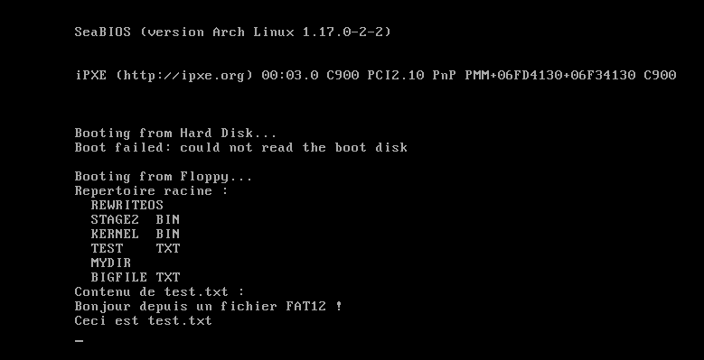
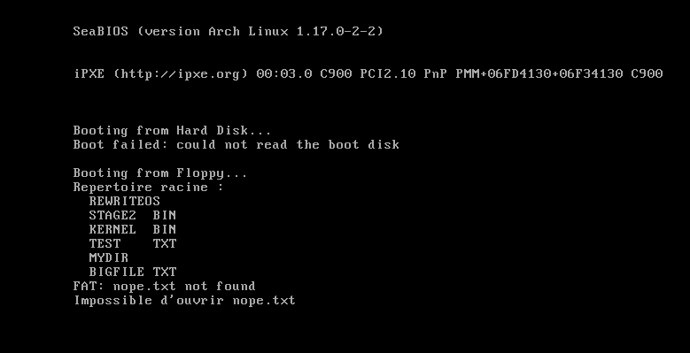

# Jour 9 : le pilote FAT dans la stage 2 / Day 9: The FAT Driver in Stage 2

[Version Française](#french) | [English Version](#english)

---

##  🇫🇷 Version Française

### Objectif

Réécrire en C, dans la stage 2, le lecteur FAT12 du jour 4, mais comme un vrai pilote : une interface simple (`FAT_Initialize`, `FAT_Open`, `FAT_Read`, `FAT_ReadEntry`, `FAT_Close`), la lecture de fichiers de n'importe quelle taille, et l'ouverture d'un fichier à partir de son chemin.

### Résultat

Mon pilote FAT liste les 6 entrées du répertoire racine, puis lit et affiche le contenu de `test.txt`, le tout depuis du code C de la stage 2.

### Ce que j'ai compris

#### Penser d'abord à celui qui utilise le code
Je voudrais utiliser mon pilote comme on utilise `stdio.h` : ouvrir, lire, fermer. D'où cinq fonctions : `FAT_Open` (ouvre un fichier ou un dossier à partir de son chemin et rend une « poignée » `FAT_File`), `FAT_Read` (lit un nombre d'octets quelconque), `FAT_ReadEntry` (lit une entrée de dossier), `FAT_Close` et `FAT_Initialize`. Le disque, lui, est passé à chaque fonction.

#### Pas de `malloc` : je choisis moi-même la mémoire
Il n'y a pas de bibliothèque standard, donc pas de `malloc`. Si je mettais les gros tampons en variables globales, ils grossiraient `stage2.bin`, qui est limité. Je range donc tout dans une structure `FAT_Data` qui est placée à une adresse que je choisis, dans une zone libre de la mémoire basse : le segment `0x0050`, soit l'adresse physique `0x00500`, sur 64 Ko au maximum (`memdefs.h`). La table FAT est copiée juste après cette structure. C'est une zone différente du segment de la stage 2 (`0x2000`), d'où l'utilisation de pointeurs **far** (`segment:offset`).

#### La poignée de fichier et le tampon d'un secteur
Chaque fichier ouvert a un tableau de 10 emplacements (`OpenedFiles`). La poignée est simplement l'indice de l'emplacement. Chaque emplacement contient la partie publique (position, taille, est-ce un dossier), le premier cluster, le cluster en cours, le secteur en cours dans le cluster, et un **tampon d'un secteur** (512 octets). Le disque ne sait lire que des secteurs entiers, mais le tampon permet à `FAT_Read` de rendre n'importe quel nombre d'octets sans relire le disque à chaque fois.

#### La racine, un fichier à part
Le répertoire racine n'est pas dans la table FAT : il occupe des secteurs consécutifs. On le traite comme un fichier ordinaire (poignée spéciale `-1`), mais pour lui, le « cluster en cours » est directement un numéro de secteur, et on passe au suivant avec `+ 1` sans consulter la FAT.

#### Comment `FAT_Read` fonctionne
Tant qu'il reste des octets à lire : on calcule combien on peut copier depuis le tampon (le plus petit entre ce qu'on demande, ce qui reste dans le fichier et ce qui reste dans le tampon), on copie, et on avance. **Quand le tampon est épuisé** (`leftInBuffer == take`), on charge le secteur suivant : le prochain secteur du cluster, ou, si le cluster est fini, le cluster suivant donné par la table FAT (entrées de 12 bits, comme au jour 4), jusqu'à une valeur supérieure ou égale à `0xFF8`.

#### Ouvrir un chemin
`FAT_Open("mydir/test.txt")` découpe le chemin à chaque `/`, et pour chaque élément : cherche son entrée dans le dossier courant (`FAT_FindFile`), ferme ce dossier, puis ouvre l'entrée trouvée. Si un élément du milieu du chemin n'est pas un dossier, ou s'il est introuvable, on affiche une erreur et on rend `NULL`.

#### Les noms FAT (8.3)
`FAT_FindFile` convertit `test.txt` en `TEST    TXT` : 8 caractères pour le nom et 3 pour l'extension, en **majuscules**, complétés par des espaces, sans le point. Ensuite il compare avec les 11 premiers octets de chaque entrée du dossier, jusqu'à une entrée dont le premier octet vaut 0 (fin du dossier).

#### Les petites fonctions qu'il a fallu écrire
Sans bibliothèque, j'ai écrit `strchr`, `strcpy`, `strlen`, `memcpy`, `memset`, `memcmp`, `islower` et `toupper`. Les versions sont volontairement simples (octet par octet) : ce sont des versions pédagogiques, les vraies bibliothèques utilisent des instructions plus rapides.

#### Ce que j'ai fait mieux que la vidéo
En préparant le code, j'ai corrigé des problèmes que l'auteur a trouvés plus tard en déboguant, et un que j'ai repéré moi-même : si le répertoire racine a plus de 16 fichiers (donc plus d'un secteur), chercher un fichier lu dans le 3e secteur laisse le tampon sur ce secteur. L'ouverture suivante démarre alors avec un mauvais tampon et ne retrouve pas `test.txt` (j'ai reproduit l'erreur avec 40 fichiers). `FAT_Open` recharge donc le premier secteur de la racine à chaque appel.

### Mini-exos

#### Exo 1 : lancer le tout
- **Commandes :** `make clean`, puis `make run`
- **Observé :** la liste du répertoire racine (`REWRITEOS`, `STAGE2  BIN`, `KERNEL  BIN`, `TEST    TXT`, `MYDIR`, `BIGFILE TXT`), puis `Bonjour depuis un fichier FAT12 !` et `Ceci est test.txt` (voir la capture plus haut).

#### Exo 2 : les adresses `segment:offset`
- **Question :** quelle adresse physique est le pointeur far `0x0050:0x0000` (la zone du pilote FAT) ? Et `0x2000:0x0000` (la stage 2) ?
- **Formule :** adresse physique = segment × 16 + offset. Multiplier par 16 revient à ajouter un `0` à droite du segment, en hexadécimal.
- **`0x0050:0x0000` :** `0x0050 × 16 = 0x0500`, plus l'offset `0x0000`, donc l'adresse physique est `0x00500` (1280 en décimal). C'est la zone du pilote FAT.
- **`0x2000:0x0000` :** `0x2000 × 16 = 0x20000`, plus l'offset `0`, donc l'adresse physique est `0x20000` (131 072 en décimal). C'est là que la stage 1 charge la stage 2.

#### Exo 3 : noms FAT sur papier
- **Convertir en format 8.3 (11 caractères) :** `test.txt`, `kernel.bin`, `mydir`, `photo.jpeg`
- **Règle :** le nom sur 8 caractères et l'extension sur 3, en majuscules, complétés par des espaces, sans le point : toujours 11 caractères au total. Je compte donc : `8 caractères de nom` + `3 d'extension`.
- **Mes résultats** (entre crochets, pour voir les espaces) :

| Nom | Format 8.3 |
|-----|------------|
| `test.txt` | `[TEST    TXT]` (`TEST` + 4 espaces + `TXT`) |
| `kernel.bin` | `[KERNEL  BIN]` (`KERNEL` + 2 espaces + `BIN`) |
| `mydir` | `[MYDIR      ]` (`MYDIR` + 6 espaces : 3 pour finir le nom, 3 pour l'extension vide) |
| `photo.jpeg` | `[PHOTO   JPE]` (`PHOTO` + 3 espaces + `JPE`) |

- **Le piège de `photo.jpeg` :** l'extension `jpeg` a 4 lettres, mais l'extension FAT n'en garde que 3 : on garde les 3 premières, `JPE` (pas `JPG`, qui est une autre extension). C'est ce que fait `FAT_FindFile` avec `i < 3`.

#### Exo 4 : un fichier qui n'existe pas
- **Modification :** dans `main.c`, ouvrir `"nope.txt"` à la place de `"test.txt"` (et ne lire que si la poignée n'est pas `NULL`)
- **Observé :** après la liste du répertoire racine, deux lignes : `FAT: nope.txt not found` puis `Impossible d'ouvrir nope.txt`.

- **Pourquoi :** `FAT_Open` parcourt toutes les entrées de la racine, ne trouve aucun nom qui corresponde à `NOPE    TXT`, affiche l'erreur `FAT: nope.txt not found` et rend `NULL`. Mon `main.c` teste ce `NULL` et affiche son propre message, au lieu de lire un fichier qui n'existe pas. Sans ce test, on lirait avec une poignée invalide.

#### Exo 5 : comprendre la boucle de lecture dans `main.c`
- **Question :** pourquoi la boucle `while ((read = FAT_Read(...)))` s'arrête-t-elle toute seule ? Pourquoi ajoute-t-on un `\r` devant chaque `\n` ?
- **Pourquoi la boucle s'arrête :** `FAT_Read` rend le **nombre d'octets réellement lus**. Quand tout le fichier a été lu, la position est égale à la taille, donc le nombre d'octets restants est 0 : `FAT_Read` rend 0, la condition de la boucle devient fausse et on sort. Aussi, si on demande 100 octets mais qu'il n'en reste que 30, elle rend 30, puis 0 à l'appel suivant.
- **Pourquoi `\r` devant `\n` :** avec la fonction du BIOS qui affiche un caractère, un saut de ligne (`\n`, code 10) descend seulement le curseur d'une ligne, sans le ramener au début. Un retour chariot (`\r`, code 13) ramène le curseur au début de la ligne. Les fichiers créés sous Linux ne contiennent que des `\n`, donc on ajoute un `\r` avant chaque `\n` pour que le texte ne parte pas en escalier.

### Erreurs rencontrées

| Erreur / symptôme | Cause | Solution |
|-------------------|-------|----------|
| _à compléter_ | | |

---

##  🇬🇧 English Version

### Goal

Rewrite in C, in stage 2, the FAT12 reader from day 4, but as a proper driver: a simple interface (`FAT_Initialize`, `FAT_Open`, `FAT_Read`, `FAT_ReadEntry`, `FAT_Close`), reading files of any size, and opening a file from its path.

### Result

My FAT driver lists the 6 entries of the root directory, then reads and prints the contents of `test.txt`, all from stage 2 C code.

### What I understood

#### Think first about whoever uses the code
I want to use my driver the way one uses `stdio.h`: open, read, close. Hence five functions: `FAT_Open` (opens a file or folder from its path and returns a `FAT_File` "handle"), `FAT_Read` (reads any number of bytes), `FAT_ReadEntry` (reads a directory entry), `FAT_Close` and `FAT_Initialize`. The disk is passed to each function.

#### No `malloc`: I choose the memory myself
There is no standard library, so no `malloc`. If I put the big buffers in global variables, they would make `stage2.bin` bigger, and it is limited. So everything goes into a `FAT_Data` structure placed at an address I choose, in a free area of low memory: segment `0x0050`, i.e. physical address `0x00500`, up to 64 KB (`memdefs.h`). The FAT table is copied right after this structure. It is a different area from stage 2's segment (`0x2000`), hence the use of **far** pointers (`segment:offset`).

#### The file handle and the one-sector buffer
There is an array of 10 slots for open files (`OpenedFiles`). The handle is simply the slot index. Each slot holds the public part (position, size, is it a directory), the first cluster, the current cluster, the current sector in the cluster, and a **one-sector buffer** (512 bytes). The disk can only read whole sectors, but the buffer lets `FAT_Read` return any number of bytes without re-reading the disk each time.

#### The root directory, a special file
The root directory is not in the FAT table: it occupies consecutive sectors. It is treated like an ordinary file (special handle `-1`), but for it the "current cluster" is directly a sector number, and we move on with `+ 1` without consulting the FAT.

#### How `FAT_Read` works
While there are bytes left to read: compute how many can be copied from the buffer (the smallest of what is requested, what remains in the file and what remains in the buffer), copy them, and advance. **When the buffer is used up** (`leftInBuffer == take`), load the next sector: the next sector of the cluster, or, if the cluster is finished, the next cluster given by the FAT table (12-bit entries, as on day 4), until a value greater than or equal to `0xFF8`.

#### Opening a path
`FAT_Open("mydir/test.txt")` splits the path at each `/`, and for each element: looks for its entry in the current directory (`FAT_FindFile`), closes that directory, then opens the entry found. If an element in the middle of the path is not a directory, or is not found, an error is printed and `NULL` is returned.

#### FAT names (8.3)
`FAT_FindFile` converts `test.txt` into `TEST    TXT`: 8 characters for the name and 3 for the extension, in **uppercase**, padded with spaces, without the dot. Then it compares with the first 11 bytes of each directory entry, until an entry whose first byte is 0 (end of the directory).

#### The small functions I had to write
Without a library, I wrote `strchr`, `strcpy`, `strlen`, `memcpy`, `memset`, `memcmp`, `islower` and `toupper`. The versions are deliberately simple (byte by byte): they are teaching versions, real libraries use faster instructions.

#### What I did better than the video
While preparing the code, I fixed problems the author found later while debugging, and one that I spotted myself: if the root directory has more than 16 files (so more than one sector), searching for a file located in the 3rd sector leaves the buffer on that sector. The next open then starts with the wrong buffer and fails to find `test.txt` (I reproduced the error with 40 files). So `FAT_Open` reloads the first sector of the root directory on every call.

### Mini-exercises

#### Exercise 1: running it
- **Commands:** `make clean`, then `make run`
- **Observed:** the root directory list (`REWRITEOS`, `STAGE2  BIN`, `KERNEL  BIN`, `TEST    TXT`, `MYDIR`, `BIGFILE TXT`), then `Bonjour depuis un fichier FAT12 !` and `Ceci est test.txt` (see the screenshot above).

#### Exercise 2: `segment:offset` addresses
- **Question:** what physical address is the far pointer `0x0050:0x0000` (the FAT driver area)? And `0x2000:0x0000` (stage 2)?
- **Formula:** physical address = segment × 16 + offset. Multiplying by 16 means adding a `0` to the right of the segment, in hexadecimal.
- **`0x0050:0x0000`:** `0x0050 × 16 = 0x0500`, plus the offset `0x0000`, so the physical address is `0x00500` (1280 in decimal). This is the FAT driver area.
- **`0x2000:0x0000`:** `0x2000 × 16 = 0x20000`, plus the offset `0`, so the physical address is `0x20000` (131,072 in decimal). This is where stage 1 loads stage 2.

#### Exercise 3: FAT names on paper
- **Convert to 8.3 format (11 characters):** `test.txt`, `kernel.bin`, `mydir`, `photo.jpeg`
- **Rule:** the name on 8 characters and the extension on 3, in uppercase, padded with spaces, without the dot: always 11 characters in total. So I count: `8 name characters` + `3 extension characters`.
- **My results** (in brackets, to see the spaces):

| Name | 8.3 format |
|------|------------|
| `test.txt` | `[TEST    TXT]` (`TEST` + 4 spaces + `TXT`) |
| `kernel.bin` | `[KERNEL  BIN]` (`KERNEL` + 2 spaces + `BIN`) |
| `mydir` | `[MYDIR      ]` (`MYDIR` + 6 spaces: 3 to finish the name, 3 for the empty extension) |
| `photo.jpeg` | `[PHOTO   JPE]` (`PHOTO` + 3 spaces + `JPE`) |

- **The `photo.jpeg` trap:** the extension `jpeg` has 4 letters, but the FAT extension keeps only 3: the first 3 letters, `JPE` (not `JPG`, which is a different extension). This is what `FAT_FindFile` does with `i < 3`.

#### Exercise 4: a file that does not exist
- **Change:** in `main.c`, open `"nope.txt"` instead of `"test.txt"` (and only read if the handle is not `NULL`)
- **Observed:** after the root directory list, two lines: `FAT: nope.txt not found` then `Impossible d'ouvrir nope.txt`.

- **Why:** `FAT_Open` goes through all the entries of the root directory, finds no name matching `NOPE    TXT`, prints the error `FAT: nope.txt not found` and returns `NULL`. My `main.c` tests that `NULL` and prints its own message, instead of reading a file that does not exist. Without this test, we would read with an invalid handle.

#### Exercise 5: understanding the read loop in `main.c`
- **Question:** why does the `while ((read = FAT_Read(...)))` loop stop by itself? Why add a `\r` in front of each `\n`?
- **Why the loop stops:** `FAT_Read` returns the **number of bytes actually read**. When the whole file has been read, the position equals the size, so the number of bytes left is 0: `FAT_Read` returns 0, the loop condition becomes false and we leave. Also, if 100 bytes are requested but only 30 remain, it returns 30, then 0 on the next call.
- **Why `\r` before `\n`:** with the BIOS character-printing function, a line feed (`\n`, code 10) only moves the cursor down one line, without bringing it back to the start. A carriage return (`\r`, code 13) brings the cursor back to the start of the line. Files created on Linux contain only `\n`, so we add a `\r` before each `\n` so that the text does not cascade like a staircase.

### Errors encountered

| Error / symptom | Cause | Solution |
|-----------------|-------|----------|
| _to be completed_ | | |
